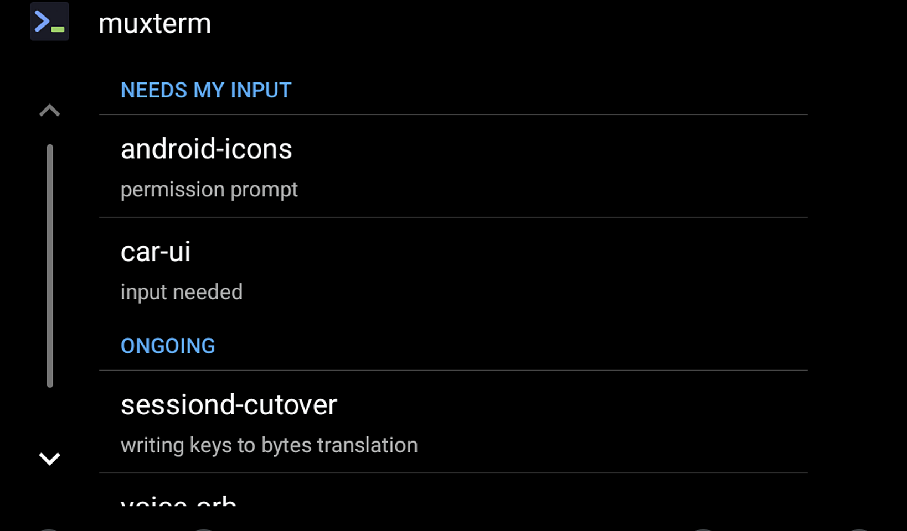
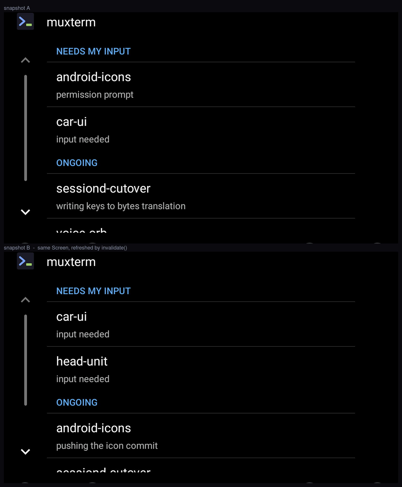

# muxterm on the car screen

The scope is narrow on purpose. No terminals in the car. The screen shows two
things — what needs the driver's input, and what is running — and everything the
driver wants to *do* they do by talking to the chief of staff. One screen, no
drill-down, which is also exactly what the driver-distraction rules want.

The drawn design and the API rationale behind the template choice live in the
sibling lane's `docs/design/android-auto-ui.md` (repo `muxterm-car-ui`). This
file records what was **built and verified**, and the one finding that changes
what is possible.

---

## The blocking finding: a sideloaded build will not run in a real car

This is the thing to know before spending another hour on it, quoted verbatim
from [Test Android apps for cars](https://developer.android.com/training/cars/testing):

> To test your app in real vehicles, you must install it from a trusted source
> such as Google Play, with one exception detailed in Allow unknown sources. You
> can use Internal App Sharing or an Internal Test Track to distribute your app
> to devices without going through the Google Play review process.

and, under **Allow unknown sources**:

> Android Auto has a developer option that lets you run apps that aren't
> installed from a trusted source. This setting applies to media, messaging
> notifications, and parked apps but **doesn't apply to apps built using the
> Android for Cars App Library.**

So the developer-mode "unknown sources" toggle — the obvious escape hatch, and
the one worth hoping for — explicitly does not cover this kind of app. `adb
install` of a debug APK will never appear on a real head unit.

**What this does and does not block:**

| Path | Works? | Google involvement |
|---|---|---|
| Desktop Head Unit, debug APK over `adb install` | **yes** — the documented dev loop | none |
| Automotive OS emulator, debug APK | **yes** — verified below | none |
| Real car, sideloaded debug APK | **no** — the quote above | — |
| Real car, Play **Internal App Sharing** | yes | Play Console account, release-signed; **no review** |
| Real car, Play **Internal Test Track** | yes | Play Console account, release-signed; **no review** |

The honest summary is not "Play approval is required". Review is *not* required.
What is required is a Play-Console-mediated install path: a developer account, a
release signing key, and an upload. The app is never listed, never public, never
reviewed. That is the price of the car screen, and it is worth knowing before
building rather than after.

---

## Category: `androidx.car.app.category.IOT`

The Car App Library only permits a fixed set of categories, and an app declares
one in its `CarAppService` intent filter. The complete supported set is
NAVIGATION, POI, IOT and WEATHER (stable), plus MEDIA, MESSAGING and CALLING
(experimental, and restricted to internal/closed test tracks). **There is no
generic "utility" or "template" category.**

IOT is the only stable category that fits a list of statuses. NAVIGATION would
oblige turn-by-turn behaviour and unlock map templates the screen has no use
for; POI and WEATHER are semantically wrong; MESSAGING is the closest fit on
paper but is `@ExperimentalCarApi` and track-restricted. IOT requires car API
level 6, hence `androidx.car.app.minCarApiLevel = 6` in the manifest.

Verified at runtime — the host's own log, negotiating with this app:

```
CarApp.H: App: [io.ampbox.muxterm/.car.MuxtermCarAppService]
          app info: [Library version: [1.7.0] Min Car Api Level: [6]
                     Latest Car App Api Level: [8]]
          Host min api: [1]  Host max api: [7]
CarApp.H: App: [io.ampbox.muxterm/.car.MuxtermCarAppService],
          Host negotiated api: [7]
```

---

## What was built

`androidx.car.app:app:1.7.0`, in `io.ampbox.muxterm.car`:

| File | Role |
|---|---|
| `MuxtermCarAppService.kt` | the service the host binds; `ALLOW_ALL_HOSTS_VALIDATOR` in debug only |
| `MuxtermSession.kt` | owns the feed's lifetime, hands back the one screen |
| `FleetScreen.kt` | `ListTemplate` with two `SectionedItemList`s |
| `FleetRepository.kt` | the `/ws` session-state feed, one socket process-wide |

Three constraints shaped the code more than anything else:

**Status cannot be carried by colour.** Not "should not" — cannot, reliably. The
host chooses light/dark variants itself to hold its own contrast ratio, may
substitute a default when a custom colour fails that check, and inside a row
only the *secondary* line accepts colour at all. So priority is carried by words
and position: "NEEDS MY INPUT" is a literal heading at the literal top. There is
no `CarColor` anywhere in the car package.

**The template quota is a trap.** Android Auto allows 5 templates per task, and
the last one must be Navigation/Pane/Message/MediaPlayback/SignIn/LongMessage —
`ListTemplate` is not on that list. A one-screen list app cannot spend steps
pushing screens, so refresh is `Screen.invalidate()` on the same screen. That is
not an optimisation here; it is the only mechanism that works.

**Blocked wins space, but working never goes silent.** The row budget comes from
`ConstraintManager.getContentLimit(CONTENT_LIMIT_TYPE_LIST)` at runtime, never a
hardcoded 6. Blocked sessions get up to `budget - 1` rows; working sessions take
the rest but always keep at least one, so "work is happening" is never invisible.
A truncated group ends with a "+N more" row.

One API detail that has to be handled rather than discovered in the car:
`addSectionedList()` throws on an empty list or an empty header, so an empty
group is never added, and a fleet with nothing blocked and nothing working falls
back to a `MessageTemplate` instead.

---

## Verified rendering, 2026-09-09

Android Auto cannot be emulated — the Desktop Head Unit tethers to a real phone.
**Android Automotive OS can be**, and it runs the same Google templates host, so
that is where this was proved without a phone in the room.

`system-images;android-33;android-automotive;x86_64` carries
`com.google.android.apps.automotive.templates.host`. The debug variant adds
`androidx.car.app:app-automotive` and a `CarAppActivity` (see
`android/app/src/debug/AndroidManifest.xml` for why that is debug-scoped), and
`android/tools/fake-fleet-feed.py` supplies a session-state feed so there is
something real to render.

```sh
./android/tools/fake-fleet-feed.py 8491 &
adb -s emulator-5558 install -r android/app/build/outputs/apk/debug/app-debug.apk
adb -s emulator-5558 shell am start -n io.ampbox.muxterm/.MainActivity -e url http://10.0.2.2:8491
adb -s emulator-5558 shell am start -n io.ampbox.muxterm/androidx.car.app.activity.CarAppActivity
```



The fixture pushes six sessions: two blocked, two working, one `done` and one
`failed`. The screen shows the four it should and drops the two it should not.

Then it pushes a second snapshot in which one blocked lane frees itself and a
new one appears, and the same screen re-renders — no new `Screen` pushed, no
template budget spent:



`android-icons` moves from NEEDS MY INPUT to ONGOING with its detail line
changed, and `head-unit` appears. 13,162 pixels differ between the two captures.

**One bug this found, and it was in the fixture, not the app.** The first version
of `fake-fleet-feed.py` ignored WebSocket ping frames. OkHttp is configured with
a 20-second ping interval, so the client dropped the connection and reconnected
every 20 seconds — which looks exactly like an app bug and was not one. The
fixture answers pings now. Worth remembering when the real server is in the loop.

### The gap in this proof

Automotive OS is not Android Auto. The templates host, the template code, the
category negotiation and the row limits are the same; the *host* is a car with
Android built in rather than a phone projecting to a screen. What this does not
exercise is the projection transport itself. That needs the DHU and the phone.

---

## Running the Desktop Head Unit here

Installed and working on this machine:

```sh
export ANDROID_HOME=/home/ken/android-toolchain/android-sdk
cd "$ANDROID_HOME/extras/google/auto"
LD_LIBRARY_PATH=/home/ken/android-toolchain/dhu-libs/lib ./desktop-head-unit --help
# Android Auto - Desktop Head Unit
#   Build: 2022-03-30-438482292
#   Version: 2.0-linux
```

The `LD_LIBRARY_PATH` is not optional and not documented anywhere obvious: the
DHU 2.x binary needs `libc++.so.1`, `libc++abi.so.1` and `libunwind.so.1`, which
Debian trixie does not ship by default. There is no root on this box, so they
were fetched with `apt-get download` and extracted, not installed:

```sh
mkdir -p ~/android-toolchain/dhu-libs && cd ~/android-toolchain/dhu-libs
apt-get download libc++1-19 libc++abi1-19 libunwind-19
for d in *.deb; do dpkg-deb -x "$d" ./extract; done
mkdir -p lib
cp -L extract/usr/lib/llvm-19/lib/libc++.so.1.0     lib/libc++.so.1
cp -L extract/usr/lib/llvm-19/lib/libc++abi.so.1.0  lib/libc++abi.so.1
cp -L extract/usr/lib/llvm-19/lib/libunwind.so.1.0  lib/libunwind.so.1
```

The DHU still needs the phone. It is not a standalone emulator: it connects to
the Android Auto app running on a real device over adb, and the device does the
projecting. The steps that only a human can perform are in
[the DHU docs](https://developer.android.com/training/cars/testing/dhu) and are
reproduced in the handoff.

Once the phone is ready, this side is one command plus one:

```sh
adb forward tcp:5277 tcp:5277
cd "$ANDROID_HOME/extras/google/auto" && \
  LD_LIBRARY_PATH=/home/ken/android-toolchain/dhu-libs/lib ./desktop-head-unit
```
