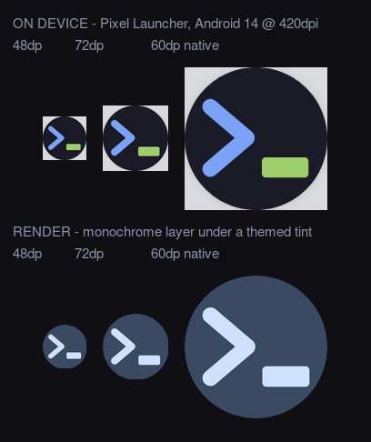
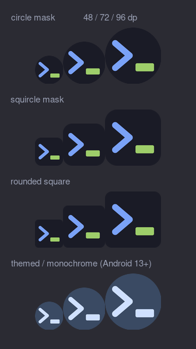

# The Android launcher icon

The Android app reuses the PWA mark from `web/public/icons/icon.svg` — a prompt chevron
and a cursor block on Tokyo Night ink. Nothing here is drawn by hand: everything under
`android/app/src/main/res/{drawable,mipmap-*}/ic_launcher*` is emitted by
`android/tools/gen-icons.sh`, which is idempotent (re-running it produces byte-identical
output).

```sh
./android/tools/gen-icons.sh            # write the res/ assets
./android/tools/gen-icons.sh --preview  # also refresh docs/design/img/android-icon-preview.png
```

## What ships

| File | Role |
|---|---|
| `drawable/ic_launcher_background.xml` | adaptive background — flat ink, edge to edge |
| `drawable/ic_launcher_foreground.xml` | adaptive foreground — chevron + block, in colour |
| `drawable/ic_launcher_monochrome.xml` | Android 13+ themed layer — same shapes, one colour |
| `mipmap-anydpi-v26/ic_launcher.xml` | `<adaptive-icon>` binding the three above |
| `mipmap-anydpi-v26/ic_launcher_round.xml` | same, for `android:roundIcon` |
| `mipmap-{m,h,xh,xxh,xxx}dpi/ic_launcher{,_round}.png` | raster fallbacks, 48–192px |

`minSdk` is 26, so every supported device uses the adaptive XML; `aapt2 dump badging`
confirms the manifest resolves to `mipmap-anydpi-v26/ic_launcher.xml` at all seven
density buckets. The rasters exist for the surfaces that demand a plain bitmap anyway.

## The one deliberate departure from the PWA mark

The web cursor is a 120×36 dash (3.3:1). Transcribed literally it lands at ~4.8px tall in
a 48dp icon, and in the themed variant — where the block loses the green that was doing
all the work of separating it from the chevron — it read as one ambiguous blob. The block
is 52 units tall here instead of 36 (2.3:1), which takes it to ~6.9px at 48dp and does not
change the scale factor to three figures. Same two shapes, same two colours, same
arrangement; a heavier cursor.

## Verification, 2026-09-09

Measured, not eyeballed. All figures from the built debug APK.

**It compiles and the layers are really in the APK.** `aapt2 dump xmltree` on
`res/mipmap-anydpi-v26/ic_launcher.xml` inside `app-debug.apk` shows `background`,
`foreground` **and** `monochrome`, the last resolving to `drawable/ic_launcher_monochrome`
(`0x7f040008`), which is present as compiled XML.

**It is centred.** Ink bounding box against canvas centre, adaptive icon composited the
way a launcher does it (108dp canvas cropped to the 72dp viewport):

| size | left margin | right margin | top | bottom |
|---|---|---|---|---|
| 48dp | 6 | 6 | 10 | 10 |
| 72dp | 9 | 9 | 16 | 15 |
| 96dp | 12 | 12 | 21 | 21 |

Symmetric to the pixel horizontally at every size, and to within one pixel vertically at
72dp (rounding). A vision-model review claimed the mark looked "pushed right at 48dp";
the measurement says otherwise and the measurement wins.

**Nothing clips.** The scale factor `k = 0.198` is set by the furthest painted pixel from
the ink centre — the cursor block's outer corner arc, ~165 units out — not by the bounding
box, which puts the worst-case ink radius at 32.7dp inside the adaptive icon's 33dp safe
circle. Confirmed on device: in the Pixel Launcher capture the ink spans x 20–135 inside a
157px disc.

**The monochrome layer is legible at 48dp — it ships.** This was the open question, since
the themed variant strips the hue that separates chevron from block. Connected-component
analysis of the monochrome layer rendered at 48dp, 8-connected, 50% threshold:

```
components (>=3px): 2
  #1: area= 196px bbox=(6,11)-(23,36)   size=18x26   <- chevron
  #2: area= 122px bbox=(26,30)-(41,37)  size=16x8    <- cursor block

MINIMUM SEPARATION: 7.07px centre-to-centre
  => 6.07px of clear ground between their nearest edges, at 48dp
  (the chevron stroke itself is 5.33px wide; the block is 6.87px tall)
```

Two shapes, not one, with more clear ground between them than the chevron's own stroke is
wide. That is a margin worth shipping on.

## Pictures

`docs/design/img/android-icon-on-device.png` — the top row is a real capture from the
Pixel Launcher on an Android 14 emulator at 420dpi, shown at 48dp, 72dp and native; the
bottom row is a render of the monochrome layer under a themed tint.



`docs/design/img/android-icon-preview.png` — the generated contact sheet: circle, squircle
and rounded-square masks plus the themed variant, each at 48/72/96dp.



### One honest gap

The bottom row above is a **render**, not a device capture. Poking `themed_icons` into the
Pixel Launcher's `com.android.launcher3.prefs.xml` did not switch the emulator's launcher
into themed mode — component analysis of the resulting screenshot came back
`#7aa2f7` and `#9ece6a`, the untouched source colours, so that capture showed the standard
icon and was discarded rather than mislabelled. The monochrome layer is therefore verified
by measuring the exact drawable geometry that ships in the APK, and by confirming the
`<monochrome>` element resolves — not by photographing a themed launcher. Turning themed
icons on by hand (Wallpaper & style → Themed icons) on a real device would close it.
