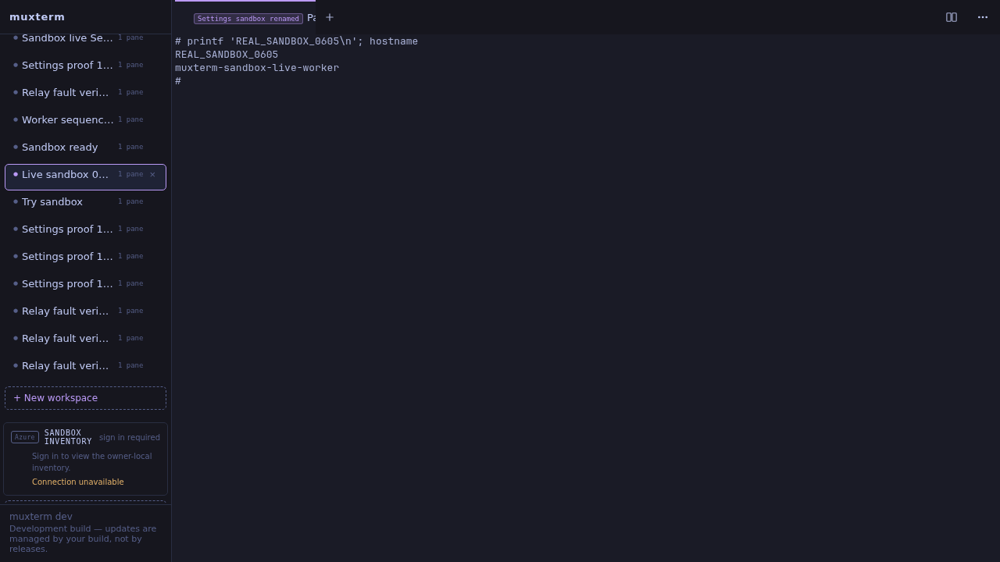

DID A HUMAN-VISIBLE SANDBOX WORKSPACE ACCEPT TYPED INPUT AND RETURN OUTPUT - YES.

On September 22, 2026 at approximately 06:05 UTC, Playwright CLI created **Live sandbox 0605** at http://127.0.0.1:33984, selected its terminal, typed a shell command, pressed Enter, and read the terminal DOM. The screenshot was visually inspected.

```text
# printf 'REAL_SANDBOX_0605\n'; hostname
REAL_SANDBOX_0605
muxterm-sandbox-live-worker
#
```



**Full Milestone 1 acceptance: incomplete.** The initial already-running-broker condition failed; the broker was restored during this run. The real worker container and sessiond were reused, not freshly provisioned. A fresh outbound agent process was enrolled. This run did not add relay implementation: the real broker routes and muxterm transport had already merged. The new PR recorded recovery and fresh verification evidence. It did not turn the Azure lifecycle stub into real provisioning.

**Azure: no real Azure resource was created, modified, or deleted in this run. No teardown was necessary. Milestone 2 was not started because the full Milestone 1 contract did not pass.** No Azure provisioning command ran.

Implementation and source boundaries

GitHub returned these implementation states:

```text
PR161 MERGED f036274e0944d7a479e53971ba2763e46eb2f664
PR150 MERGED ddf846afa2a5771040b1d08f568039ea6dbafb41
broker PR16 MERGED https://github.com/kenotron-ms/amplifier-sandboxes/pull/16
broker checkout: a258e40 fix: retain Amplifier provider in runtime home in sandbox image
fresh verification worktree: 6833a38
```

The existing muxterm implementation was https://github.com/kenotron-ms/muxterm/pull/161 and its Settings integration was https://github.com/kenotron-ms/muxterm/pull/163. The actual broker changes were https://github.com/kenotron-ms/amplifier-sandboxes/pull/16. Broker source registration was inspected directly:

```text
814:    from broker.muxterm_relay import attach_relay
816:    attach_relay(app, registry)
841:    vault = FakeVault(path=data_dir / "fake_vault.json")
855:        from broker.stub_backend import StubBackend
857:        backend = StubBackend(storage_root=data_dir / "sandboxes")
```

`StubBackend` was a **stub lifecycle backend**, `FakeVault` was a **placeholder**, and the JSONL owner registry was **manually enrolled placeholder inventory**. Incus supplied the real retained sandbox container. The browser scripts and fault proxy were **verification fixtures**. The broker relay, outbound agent, Unix socket, sessiond and shell were real. PR161's **reference broker** and **synthetic workspace** `sandbox:fixture/w7` were not used for this proof; the remote host was `sandbox:live-local`.

Broker discovery and restarts

Host `ss -lntp`, process inspection, retained checkout inspection and a direct HTTP connection attempt found no running sandbox broker initially. This contradicted the instruction's running-service premise:

```text
curl: (7) Failed to connect to 127.0.0.1 port 8088 after 0 ms: Could not connect to server
systemctl --user list-units --all '*broker*':
0 loaded units listed.
```

The retained startup rig restored the authorized broker from `/home/ken/work/sandbox-broker-live`. The first old PID below came from its stale PID file, not a live process. The authorization fault check later restarted the restored process:

```text
Restarted owned broker PID 2156056 -> 2174539 port 8088
Restarted owned broker PID 2174539 -> 2177822 port 8088
```

The final process was identified by listener ownership and `/proc/2177822/cwd`:

```text
/home/ken/work/sandbox-broker-live
LISTEN 127.0.0.1:8088 users:(("python",pid=2177822,fd=7))
```

Startup used the retained Python environment and command:

```text
/home/ken/workspace/sandboxes/.venv/bin/python -m uvicorn broker.app:default_app --host 127.0.0.1 --port 8088 --timeout-graceful-shutdown 5 --app-dir .
```

The TLS broker front end remained nginx in the retained client container. Incus forwarded its loopback upstream to host port 8088:

```text
listen 443 ssl;
proxy_pass http://127.0.0.1:18080;
proxy_buffering off;
broker8088:
  bind: container
  connect: tcp:127.0.0.1:8088
  listen: tcp:127.0.0.1:18080
  type: proxy
```

Worker topology

The worker agent opened outbound HTTPS to that TLS front end. Commands returned through the worker's polling connection. Its sessiond stayed on a private Unix socket. Direct inspection after fault cleanup returned:

```text
2050 /opt/relay/bin/muxterm sessiond
2688 /opt/relay/bin/agent --config /opt/relay/worker.json --socket /opt/relay/runtime/muxterm/sessiond.sock
$ ss -lntup
Netid State Recv-Q Send-Q Local Address:Port Peer Address:PortProcess
$ stat -c '%a %n' /opt/relay/runtime/muxterm/sessiond.sock
600 /opt/relay/runtime/muxterm/sessiond.sock
$ iptables -S
-P INPUT DROP
-P FORWARD ACCEPT
-P OUTPUT DROP
-A INPUT -i lo -j ACCEPT
-A INPUT -m conntrack --ctstate RELATED,ESTABLISHED -j ACCEPT
-A OUTPUT -o lo -j ACCEPT
-A OUTPUT -d 10.9.113.136/32 -p tcp -m tcp --dport 443 -j ACCEPT
```

Browser connection and input

The retained Settings browser rig saved the owner credential through the isolated UI, checked rejected credentials, then created a fresh workspace and typed into its real shell. Output:

```text
PASS Settings saved and connected without environment configuration; GET and form omitted token
PASS invalid token rejected; prior connection retained
PASS blank token retained for unchanged broker and sandbox; live rename applied
PASS browser-created remote workspace returned SETTINGS_RELAY_INPUT_OK and muxterm-sandbox-live-worker
```

After delivery faults and proxy removal, a separate Playwright CLI session created the final workspace. Its DOM evaluation returned:

```text
"# printf 'REAL_SANDBOX_0605\\n'; hostname\nREAL_SANDBOX_0605\nmuxterm-sandbox-live-worker\n#  "
```

Delivery faults

The existing rigs `sandbox-live-fault-verify.py`, `sandbox-live-worker-order.py` and `sandbox-live-auth-verify.py` were reused, with the retained fault proxy from the original relay verification. They operated on fresh real shell workspaces. Output:

```text
PASS redeliver {'hits': 1, 'held': True, 'duplicates': 2}
PASS lost-response {'hits': 2, 'held': True, 'duplicates': 0}
PASS output SSE disconnect/reconnect with same live daemon connection
PASS worker crash after Unix write: fresh epoch, no repeated shell side effect
PASS role and binding authorization rejects invalid/cross-role/cross-host access
PASS out-of-order input rejected; closed connection cannot receive input
Secure broker mode used real Entra validation and fresh single-use enrollment after worker crash.
PASS worker rejected deliberately reordered input (seq+1); shell side-effect file absent: /tmp/WORKER_ORDER_MUST_NOT_EXECUTE-1790057016622266007
Fault counters: {"mode": "worker-order", "hits": 1, "held": true, "duplicates": 0, "sse_cuts": 1}
PASS real Entra bearer accepted on live broker /discover: HTTP 200
PASS consumed enrollment replay: HTTP 401
PASS Entra client token rejected on worker route: HTTP 401
PASS ownership revocation rejected previously valid Entra owner: HTTP 403
PASS revoked connection stayed fenced after owner restored: HTTP 410
PASS broker restart and fresh enrollment rejected old connection input: HTTP 410
```

These checks read real shell side-effect files. Repeated delivery and lost acknowledgments left one line. A worker crash after the Unix write left one line after reconnect. Deliberate sequence reordering left no command side effect. This established the injected cases, not exactly-once shell execution under arbitrary failures.

Temporary fault infrastructure was removed before final browser verification:

```text
Removed fault proxy 9119
Device live0605-fault removed from muxterm-sandbox-live-normal
Fresh worker enrollment and process: 2688
```

Checks and limitations

The new source worktree passed static checks after generating web assets. The first Go invocation failed on missing generated assets; the subsequent root build completed successfully:

```text
initial go build ./...: web/embed.go:19:12: pattern dist-public/*: no matching files found
npm ci --ignore-scripts: exit 0
npm run check:fast: exit 0
npm run build: exit 0
root go build ./... after assets: exit 0
```

No unit tests ran. Browser verification used the retained isolated executable, not a deployment of the fresh source build. The isolated UI's Azure inventory remained unavailable; the remote terminal proof did not establish Azure controller attachment. Current controller source still contained:

```text
internal/sandboxazure/controller.go:263: return ErrAttachUnsupported
sandbox attach is unsupported: Azure Sandbox port transport has not established authenticated sessiond WebSocket framing
```

Production muxterm PIDs remained unchanged through this run:

```text
PID COMMAND
538 caddy
2170317 muxterm
2170318 muxterm
```

The checkout `/home/ken/work/muxterm` contained another lane's uncommitted changes on `feat/codex-owned-hooks`; it was left alone. Changes for this delivery were confined to the new `verify/sandbox-live-0605` worktree and evidence artifacts. No merge, release, production config edit or production restart ran.

Handoff

Interactive client: http://127.0.0.1:33984, workspace **Live sandbox 0605**. Broker PID at final inspection: **2177822**. Worker agent: **2688**. The pre-existing `muxterm-sandbox-live-normal` and `muxterm-sandbox-live-worker` containers remained under Ken's teardown ownership; this run created no container. The broker was left running for the user. The retained owner credential expired at 06:24:11 UTC; automatic renewal remained absent. This was a time-bounded local session, not completed unattended sandbox provisioning.
