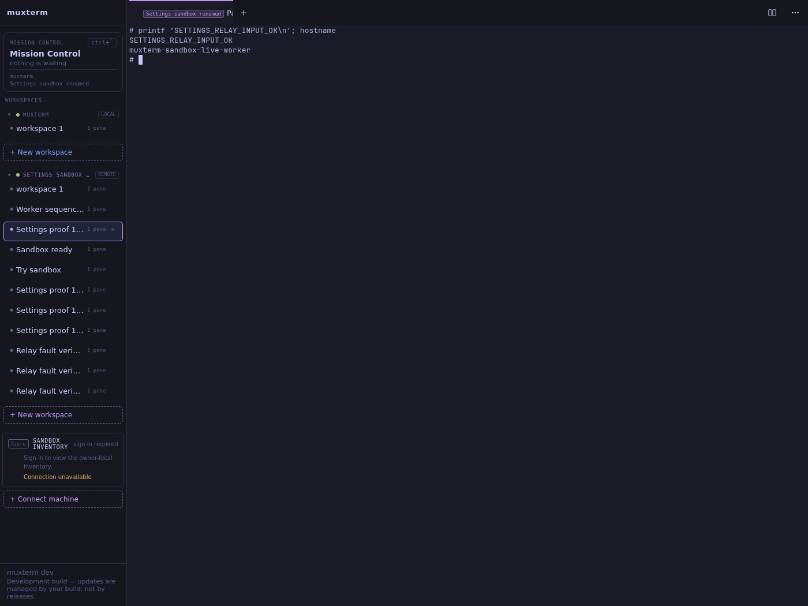
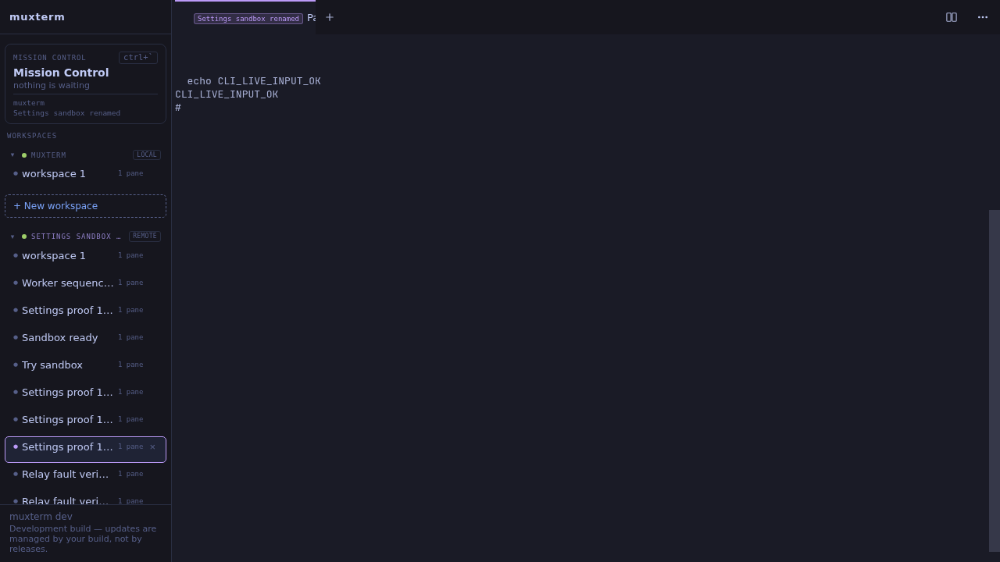

DID A HUMAN-VISIBLE SANDBOX WORKSPACE ACCEPT TYPED INPUT AND RETURN OUTPUT - YES.

Reverified September 21, 2026, 07:41 UTC at http://127.0.0.1:33984.
Browser automation created a fresh workspace through the remote sidebar and
entered this command with keyboard events. The terminal returned:

```text
# printf 'SETTINGS_RELAY_INPUT_OK\n'; hostname
SETTINGS_RELAY_INPUT_OK
muxterm-sandbox-live-worker
#
```



A subsequent playwright-cli browser session entered another command:

```text
echo CLI_LIVE_INPUT_OK
CLI_LIVE_INPUT_OK
#
```



The implementation already existed and had merged before this run. I recovered
its stopped broker and expired credentials, exercised the real implementation,
and opened this evidence PR. I did not rewrite the merged feature or claim new
product implementation. GitHub returned:

```text
muxterm PR161: MERGED f036274e0944d7a479e53971ba2763e46eb2f664
muxterm PR150: MERGED ddf846afa2a5771040b1d08f568039ea6dbafb41
muxterm PR163: MERGED
amplifier-sandboxes PR16: MERGED
origin/main: 7308a71 Merge pull request #163 from kenotron-ms/feat/sandbox-relay-startup
```

Implementation: https://github.com/kenotron-ms/muxterm/pull/163
Broker changes: https://github.com/kenotron-ms/amplifier-sandboxes/pull/16
PR161's reference broker and synthetic sandbox:fixture/w7 were not used.

Broker discovery and recovery

Initial host TCP listener and Python process inspection found no running sandbox
broker. The historical report identified the retained service checkout, private
manifest and previous PID. Direct probing and PID inspection returned:

```text
curl: (7) Failed to connect to 127.0.0.1 port 8088 after 0 ms: Could not connect to server
    PID COMMAND
Stored owner token expiry: 2026-09-21T07:22:54+00:00
```

I renewed the Entra credential through the existing Azure CLI login and restarted
the authorized broker from /home/ken/work/sandbox-broker-live. Its checked-out
commit was a258e40. The restart rig launched the existing FastAPI application
using /home/ken/workspace/sandboxes/.venv/bin/python -m uvicorn
broker.app:default_app --host 127.0.0.1 --port 8088 --app-dir .
The second restart exercised old-connection fencing:

```text
Renewed owner token; expiry: 2026-09-21 08:44:08.000000
Restarted owned broker PID 1890167 -> 1947827 port 8088
Restarted owned broker PID 1947827 -> 1951694 port 8088
```

/proc/1947827/cwd resolved to /home/ken/work/sandbox-broker-live.
Final listener inventory returned:

```text
LISTEN 127.0.0.1:8088 users:(("python",pid=1951694,fd=7))
LISTEN 127.0.0.1:9090 users:(("muxterm",pid=1945653,fd=3))
LISTEN *:8311 users:(("caddy",pid=538,fd=3))
```

The existing separate Incus worker container was reused, not newly provisioned.
Its real sessiond retained its shells; a fresh outbound agent enrolled against
the restarted broker. The client used normal muxterm serve and its Settings
relay configuration, not the experimental reference serve executable.
The browser verification returned:

```text
PASS Settings saved and connected without environment configuration; GET and form omitted token
PASS invalid token rejected; prior connection retained
PASS blank token retained for unchanged broker and sandbox; live rename applied
PASS browser-created remote workspace returned SETTINGS_RELAY_INPUT_OK and muxterm-sandbox-live-worker
Fresh worker enrollment and process: 2266
Isolated Settings demo PID 8395 MUXTERM_RELAY_CONFIG unset
```

The actual FastAPI broker handled relay routes and Entra authorization. Its
unrelated lifecycle backend remained StubBackend (a stub), FakeVault remained
an unused placeholder, and the existing JSONL registry remained a placeholder
registry. Incus provisioned the retained local worker, not that stub. The browser
scripts and fault proxy were verification fixtures. This run used no mock shell,
mock sessiond, reference broker or synthetic workspace. HTTPS terminated at
nginx in the client container and forwarded through the Incus bridge to the
broker's loopback HTTP listener. The sandbox opened outbound HTTPS only.

Worker inspection returned:

```text
$ ss -lntup
Netid State Recv-Q Send-Q Local Address:Port Peer Address:PortProcess
$ stat -c '%a %n' /opt/relay/runtime/muxterm/sessiond.sock
600 /opt/relay/runtime/muxterm/sessiond.sock
$ iptables -S
-P INPUT DROP
-P FORWARD ACCEPT
-P OUTPUT DROP
-A INPUT -i lo -j ACCEPT
-A INPUT -m conntrack --ctstate RELATED,ESTABLISHED -j ACCEPT
-A OUTPUT -o lo -j ACCEPT
-A OUTPUT -d 10.9.113.136/32 -p tcp -m tcp --dport 443 -j ACCEPT
```

Delivery faults

The existing sandbox-live-fault-verify.py, sandbox-live-worker-order.py and
sandbox-live-auth-verify.py ran against this real broker, real worker and real
sessiond. Each verification run created a fresh workspace. Completed output:

```text
PASS redeliver {'hits': 1, 'held': True, 'duplicates': 2}
PASS lost-response {'hits': 2, 'held': True, 'duplicates': 0}
PASS output SSE disconnect/reconnect with same live daemon connection
PASS worker crash after Unix write: fresh epoch, no repeated shell side effect
PASS role and binding authorization rejects invalid/cross-role/cross-host access
PASS out-of-order input rejected; closed connection cannot receive input
Secure broker mode used real Entra validation and fresh single-use enrollment after worker crash.
PASS worker rejected deliberately reordered input (seq+1); shell side-effect file absent: /tmp/WORKER_ORDER_MUST_NOT_EXECUTE-1789976352536371848
Fault counters: {"mode": "worker-order", "hits": 1, "held": true, "duplicates": 0, "sse_cuts": 1}
PASS real Entra bearer accepted on live broker /discover: HTTP 200
PASS consumed enrollment replay: HTTP 401
PASS Entra client token rejected on worker route: HTTP 401
PASS ownership revocation rejected previously valid Entra owner: HTTP 403
PASS revoked connection stayed fenced after owner restored: HTTP 410
PASS broker restart and fresh enrollment rejected old connection input: HTTP 410
```

These outputs established deduplication, ordering rejection and no replay after
the injected uncertain delivery. They did not establish exactly-once execution
across arbitrary failures. Two initial harness attempts failed: I forwarded its
control port to 18082 instead of 18081, then edited an inactive nginx config.
Those failures were excluded; the complete run above followed both corrections.
Removing the proxy terminated the agent; fresh enrollment and an isolated client
serve restart restored connectivity before the final successful browser run.
The proxy process and its temporary host forwarding device were removed:

```text
Removed verification fault proxy 7933
Device recheck-fault removed from muxterm-sandbox-live-normal
```

Azure milestone

No Azure resource was created, changed or deleted in this run. No Azure teardown
was necessary. After the local proof, read-only Azure preflight returned:

```json
{"id":"/subscriptions/8a673afb-d858-4a97-a490-2625396d1484/resourceGroups/rg-amplifier-sandboxes/providers/Microsoft.App/sandboxGroups/sg-amplifier-sandboxes","state":"Succeeded"}
```

The first query used an unsupported API version; Azure supplied the supported
2026-02-01-preview version, and that query succeeded. The sandbox list contained
other Hub-owned resources; none was touched. PR150's requested controller path
remained incomplete. The merged controller's Attach body still ended with:

```go
return ErrAttachUnsupported
```

Its error text remained:

```text
sandbox attach is unsupported: Azure Sandbox port transport has not established authenticated sessiond WebSocket framing
```

No resource was provisioned through a controller with that known attach blocker.
The prior Azure report recorded a different, manually provisioned Azure proof
and its teardown; that historical proof did not exercise PR150's controller.
It was not counted as this run's milestone 2 success.

Validation and handoff

Required checks on origin/main completed:

```text
npm run check:fast: exit 0 (existing warnings)
npm run build: exit 0 (existing warnings)
go build ./...: exit 0
```

The initial Go build lacked generated web/dist-public; building the frontend
resolved it. No unit tests ran. Production muxterm processes/configuration,
other worktrees, Amplifier source and agent settings were not changed.

The retained interactive UI was http://127.0.0.1:33984. Ken retained ownership of
the already-existing muxterm-sandbox-live-normal and muxterm-sandbox-live-worker
containers and their eventual teardown. No new container was created. The broker
remained PID 1951694, and the final agent remained PID 2266 inside its container.
The owner credential expired at 08:44 UTC; the worker enrollment lasted one hour.
Automatic renewal and PR150 attachment remained absent. The working proof was
not an unattended deployment. No merge, release or production installation ran.
