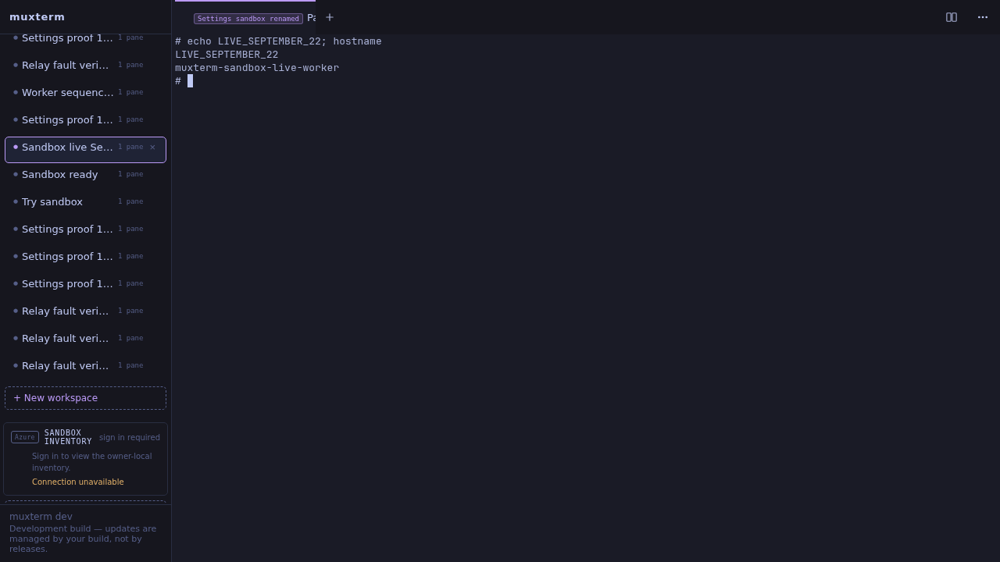

DID A HUMAN-VISIBLE SANDBOX WORKSPACE ACCEPT TYPED INPUT AND RETURN OUTPUT - YES.

Verified September 22, 2026, at http://127.0.0.1:33984 in the isolated muxterm client. Playwright CLI created **Sandbox live September 22** through the remote sidebar, typed into its terminal, and read the returned shell output:

```text
# echo LIVE_SEPTEMBER_22; hostname
LIVE_SEPTEMBER_22
muxterm-sandbox-live-worker
#
```



This run recovered and verified the already-merged implementation. It did not implement a second relay. The delivery PR contains fresh evidence, not new product implementation. Source inspection and GitHub returned:

```text
muxterm PR161 MERGED f036274e0944d7a479e53971ba2763e46eb2f664
muxterm PR163 MERGED 7308a71718493f8a99d8eee0ac5a28258c6b408f
amplifier-sandboxes PR16 MERGED
verification worktree origin/main: ae2af03
retained broker source commit: a258e40
```

Implementation references: https://github.com/kenotron-ms/muxterm/pull/161 and https://github.com/kenotron-ms/muxterm/pull/163. Actual broker changes: https://github.com/kenotron-ms/amplifier-sandboxes/pull/16, `broker/muxterm_relay.py`, registered by `broker/app.py`.

Broker discovery and restart

The instruction's already-running premise was false at inspection time. Host listener/process inspection found no sandbox broker; the retained report identified its checkout and startup rig. The direct probe returned:

```text
curl: (7) Failed to connect to 127.0.0.1 port 8088 after 0 ms: Could not connect to server
```

I renewed the existing Entra owner token and restarted the authorized retained broker. The first enrollment request raced startup and returned connection refused; the retry succeeded. The later authorization fault run restarted it again:

```text
Renewed owner token; expiry: 2026-09-22 06:24:11.000000
Restarted owned broker PID 1951694 -> 2150999 port 8088
Fresh worker enrollment and process: 2548
Restarted owned broker PID 2150999 -> 2156056 port 8088
```

Final process identification came from `/proc/PID/cwd`, listener ownership and the retained startup command:

```text
/proc/2156056/cwd -> /home/ken/work/sandbox-broker-live
LISTEN 127.0.0.1:8088 users:(("python",pid=2156056,fd=7))
/home/ken/workspace/sandboxes/.venv/bin/python -m uvicorn broker.app:default_app --host 127.0.0.1 --port 8088 --timeout-graceful-shutdown 5 --app-dir .
```

Real components and explicit substitutes

The broker ran the actual FastAPI relay and Entra authorization. Its lifecycle backend remained **StubBackend (a stub)**; `FakeVault` remained a placeholder, and its manually enrolled JSONL registry remained a **placeholder registry**. Incus supplied the real retained worker container, not the stub lifecycle backend. Source inspection returned:

```text
broker/app.py:814: from broker.muxterm_relay import attach_relay
broker/app.py:841: vault = FakeVault(path=data_dir / "fake_vault.json")
broker/app.py:855: from broker.stub_backend import StubBackend
broker/app.py:857: backend = StubBackend(storage_root=data_dir / "sandboxes")
```

The browser scripts and temporary fault proxy were **verification fixtures**. The shell, sessiond, worker and broker relay were real. PR161's reference broker and synthetic `sandbox:fixture/w7` were absent from this path. The real host was `sandbox:live-local`. The retained worker and client containers were reused; no new container was provisioned in this run. Worker inspection returned:

```text
2050 /opt/relay/bin/muxterm sessiond
2603 /opt/relay/bin/agent --config /opt/relay/worker.json --socket /opt/relay/runtime/muxterm/sessiond.sock
$ ss -lntup
Netid State Recv-Q Send-Q Local Address:Port Peer Address:PortProcess
$ stat -c '%a %n' /opt/relay/runtime/muxterm/sessiond.sock
600 /opt/relay/runtime/muxterm/sessiond.sock
$ iptables -S
-P INPUT DROP
-P FORWARD ACCEPT
-P OUTPUT DROP
-A INPUT -i lo -j ACCEPT
-A INPUT -m conntrack --ctstate RELATED,ESTABLISHED -j ACCEPT
-A OUTPUT -o lo -j ACCEPT
-A OUTPUT -d 10.9.113.136/32 -p tcp -m tcp --dport 443 -j ACCEPT
```

TLS terminated at the retained nginx broker front end in the client container; its Incus forwarding device connected to the broker's host-loopback HTTP listener. The worker opened outbound HTTPS and the private Unix socket. The local muxterm used the normal Settings relay configuration. Browser verification returned:

```text
PASS Settings saved and connected without environment configuration; GET and form omitted token
PASS invalid token rejected; prior connection retained
PASS blank token retained for unchanged broker and sandbox; live rename applied
PASS browser-created remote workspace returned SETTINGS_RELAY_INPUT_OK and muxterm-sandbox-live-worker
```

Delivery fault evidence

The retained `sandbox-live-fault-verify.py`, `sandbox-live-worker-order.py` and `sandbox-live-auth-verify.py` exercised the real processes. They reused the fault proxy from the existing relay rigs. Each run created a fresh workspace. Completed output:

```text
Fresh worker enrollment and process: 2570
PASS redeliver {'hits': 1, 'held': True, 'duplicates': 2}
PASS lost-response {'hits': 2, 'held': True, 'duplicates': 0}
PASS output SSE disconnect/reconnect with same live daemon connection
PASS worker crash after Unix write: fresh epoch, no repeated shell side effect
PASS role and binding authorization rejects invalid/cross-role/cross-host access
PASS out-of-order input rejected; closed connection cannot receive input
Secure broker mode used real Entra validation and fresh single-use enrollment after worker crash.
Fresh worker enrollment and process: 2580
PASS worker rejected deliberately reordered input (seq+1); shell side-effect file absent: /tmp/WORKER_ORDER_MUST_NOT_EXECUTE-1790054057178235516
Fault counters: {"mode": "worker-order", "hits": 1, "held": true, "duplicates": 0, "sse_cuts": 1}
Restarted owned broker PID 2150999 -> 2156056 port 8088
Fresh worker enrollment and process: 2595
PASS real Entra bearer accepted on live broker /discover: HTTP 200
PASS consumed enrollment replay: HTTP 401
PASS Entra client token rejected on worker route: HTTP 401
PASS ownership revocation rejected previously valid Entra owner: HTTP 403
PASS revoked connection stayed fenced after owner restored: HTTP 410
PASS broker restart and fresh enrollment rejected old connection input: HTTP 410
```

The repeated command produced one shell side effect; lost acknowledgments did not duplicate it. Deliberately reordered input was rejected at the worker. Killing only the agent after the Unix write and before acknowledgment did not replay the input into a replacement connection. These runs established those injected cases, not exactly-once execution across arbitrary failures.

The temporary fault proxy and forwarding device were removed before the final browser proof:

```text
Removed fault proxy 8627
Device live0922-fault removed from muxterm-sandbox-live-normal
Fresh worker enrollment and process: 2603
```

Azure milestone: incomplete

No real Azure resource was created, modified or deleted in this run. No Azure teardown was necessary. After the local browser and fault checks passed, the read-only target-subscription preflight returned:

```json
{
  "id": "/subscriptions/8a673afb-d858-4a97-a490-2625396d1484/resourceGroups/rg-amplifier-sandboxes/providers/Microsoft.App/sandboxGroups/sg-amplifier-sandboxes",
  "state": "Succeeded"
}
```

PR150's controller attach path remained explicitly unsupported. Inspection at `ae2af03`, `internal/sandboxazure/controller.go:263`, returned:

```go
return ErrAttachUnsupported
```

The error remained:

```text
sandbox attach is unsupported: Azure Sandbox port transport has not established authenticated sessiond WebSocket framing
```

No Azure resource was provisioned behind that known attach blocker. The historical manual Azure proof was not counted as this run's controller proof. Milestone 2 did not pass.

Checks and handoff

Required static commands completed in the fresh `verify/sandbox-live-20260922` worktree:

```text
npm ci: exit 0
npm run check:fast: exit 0 (existing warnings)
npm run build: exit 0
go build ./...: exit 0
```

No unit tests ran. Production processes retained their original PIDs:

```text
2147288 muxterm sessiond
2147289 muxterm serve (9090)
538 caddy (8311)
```

The browser proof used the retained isolated executable, not a newly deployed build of `ae2af03`. The newly checked-out source passed static checks; that distinction prevents treating the browser result as fresh deployment coverage for unrelated upstream changes.

The retained interactive client remained http://127.0.0.1:33984, workspace **Sandbox live September 22**, broker PID **2156056**, worker agent PID **2603**. Ken retained teardown ownership of the pre-existing `muxterm-sandbox-live-normal` and `muxterm-sandbox-live-worker` containers. Production muxterm configuration/processes and other lanes were untouched. No merge, release, or production installation ran.

The renewed owner token expiry was **06:24:11 UTC**; worker authority had a one-hour lease. Automatic renewal remained absent. This was a working time-bounded local sandbox, not an unattended Azure deployment. Initial running-broker discovery and fresh provisioning were not claimed: the broker was stopped initially and the worker container already existed.
