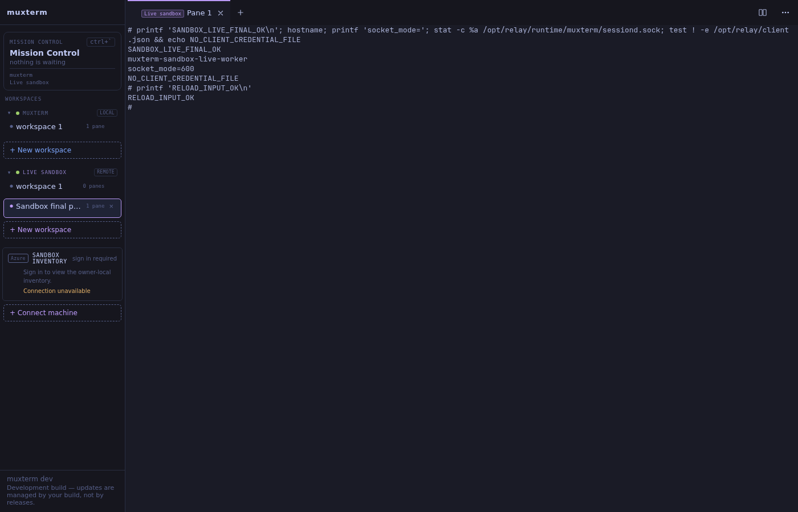
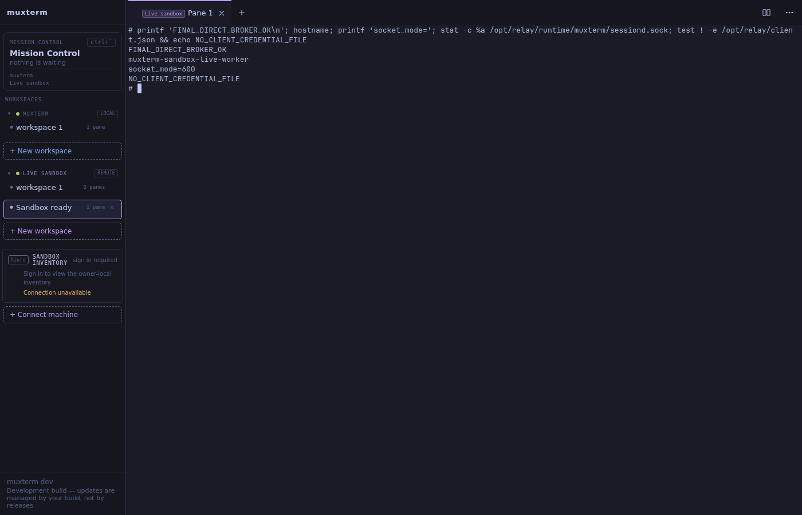

DID A HUMAN-VISIBLE SANDBOX WORKSPACE ACCEPT TYPED INPUT AND RETURN OUTPUT - YES.

On September 21, normal `muxterm serve` displayed `Sandbox final proof` under
`Live sandbox`. Browser keyboard actions reached a real shell in the separate
Incus container `muxterm-sandbox-live-worker`, through the actual
amplifier-sandboxes FastAPI broker on port 8088. The browser was automated; no
human personally typed during verification. No HTTP shortcut injected the proof
command. The experimental reference broker and experimental serve executable
were absent from this path.

The final terminal contents were:

```text
# printf 'SANDBOX_LIVE_FINAL_OK\n'; hostname; printf 'socket_mode='; stat -c %a /opt/relay/runtime/muxterm/sessiond.sock; test ! -e /opt/relay/client.json && echo NO_CLIENT_CREDENTIAL_FILE
SANDBOX_LIVE_FINAL_OK
muxterm-sandbox-live-worker
socket_mode=600
NO_CLIENT_CREDENTIAL_FILE
# printf 'RELOAD_INPUT_OK\n'
RELOAD_INPUT_OK
#
```

The second command followed a browser reload and workspace reselection.



The source changes added normal muxterm local/serve/MCP relay startup alongside
SSH, a standalone `muxterm-sandbox-agent`, and an owner enrollment helper.
The broker changes added an Entra-authorized mode with owner/lifecycle checks,
single-use enrollment, one-hour worker credentials, and a single-process lock.
The runtime and authorization outputs below established the exercised behavior;
they did not establish Azure attachment or unattended production operation.

The live broker was located by host listener/process inspection. Before restart:

```text
LISTEN 127.0.0.1:8088 users:(("uvicorn",pid=1782462,fd=6))
1782462 /home/ken/workspace/sandboxes/.venv/bin/python3 .venv/bin/uvicorn broker.app:default_app --host 127.0.0.1 --port 8088 --app-dir .
```

Its source checkout was `/home/ken/workspace/sandboxes`, branch
`feat/local-muxterm-relay`, commit `33487e0`. That newer work and broker PR #14
already existed when this implementation resumed; my earlier claim that no
broker changes had been checked in was incorrect. I preserved that branch and
made new changes in `/home/ken/work/sandbox-broker-live` on
`feat/relay-owner-enrollment`. Muxterm changes used the separate worktree
`/home/ken/work/muxterm-sandbox-live`, branch `feat/sandbox-relay-startup`, based
on PR #161's existing implementation.

**The authorized broker was restarted.** The first restart replaced PID 1782462
with 1871883 on the same port 8088. The restart/fencing verification then replaced
1871883 with 1881014. Both launches used the new source worktree and private
verification config. The alternate broker on 8089 and its older verification
container were left alone. Production muxterm PID 1176665 on 9090 and Caddy PID
538 on 8311 remained present in the final listener output.

This was local runtime provisioning through Incus. The broker's unrelated
lifecycle backend remained **StubBackend, a stub**, and its existing **FakeVault
placeholder** remained unused by relay traffic. Its JSONL registry remained the
existing **placeholder registry**; I manually enrolled the actual local container
against the verified Entra owner. No stub lifecycle operation provisioned the
worker. The scripts and fault proxy were **verification fixtures**. The shell,
PTY, sessiond, agent, Entra JWT validation, HTTPS traffic and FastAPI routes were
real. The sandbox had a separate filesystem and process namespace from the
client; client credentials were not copied into it. These facts did not establish
Azure image provenance or isolation against kernel exploits.

TLS terminated at nginx in the client verification container and forwarded to
host loopback 8088 through an Incus bridge. The worker opened only outbound
HTTPS to that TLS endpoint. Its private sessiond socket was mode 600. After
replacing DHCP with a static address, both TCP and UDP listener inventories were
empty. The host UI forwarding device was restricted to 127.0.0.1 before handoff.

```text
$ ss -ltnp
LISTEN 0      4096                     127.0.0.1:9090       0.0.0.0:*    users:(("muxterm",pid=1176665,fd=3))        
LISTEN 0      2048                     127.0.0.1:8088       0.0.0.0:*    users:(("python",pid=1881014,fd=7))         
LISTEN 0      4096                             *:8311             *:*    users:(("caddy",pid=538,fd=3))              
LISTEN 0      4096                     127.0.0.1:33984      0.0.0.0:*                                                

$ incus exec muxterm-sandbox-live-worker -- ss -lntup
Netid State Recv-Q Send-Q Local Address:Port Peer Address:PortProcess

$ incus exec muxterm-sandbox-live-worker -- iptables -S
-P INPUT DROP
-P FORWARD ACCEPT
-P OUTPUT DROP
-A INPUT -i lo -j ACCEPT
-A INPUT -m conntrack --ctstate RELATED,ESTABLISHED -j ACCEPT
-A OUTPUT -o lo -j ACCEPT
-A OUTPUT -d 10.9.113.136/32 -p tcp -m tcp --dport 443 -j ACCEPT

$ incus exec muxterm-sandbox-live-worker -- stat -c %a %n /opt/relay/runtime/muxterm/sessiond.sock
600 /opt/relay/runtime/muxterm/sessiond.sock

$ incus exec muxterm-sandbox-live-worker -- cat /opt/relay/pids.json
{"sessiond": 2000, "agent": 2008}
$ incus exec muxterm-sandbox-live-normal -- cat /opt/relay/pids.json
{"sessiond": 5518, "serve": 5525}
$ curl -fsS http://127.0.0.1:33984/api/remotes
{"connected":[{"id":"sandbox:live-local","name":"Live sandbox","target":"","transport":"sandbox","managed":false,"state":"connected","probe":"unknown"}],"discovered":[],"errors":[]}

```

The existing fault-injection rig was adapted to normal `muxterm mcp` and the
separate worker container. The successful complete run produced:

```text
Fresh worker enrollment and process: 1938
PASS redeliver {'hits': 1, 'held': True, 'duplicates': 2}
PASS lost-response {'hits': 2, 'held': True, 'duplicates': 0}
PASS output SSE disconnect/reconnect with same live daemon connection
PASS worker crash after Unix write: fresh epoch, no repeated shell side effect
PASS role and binding authorization rejects invalid/cross-role/cross-host access
PASS out-of-order input rejected; closed connection cannot receive input
Secure broker mode used real Entra validation and fresh single-use enrollment after worker crash.
Fresh worker enrollment and process: 1949
PASS worker rejected deliberately reordered input (seq+1); shell side-effect file absent: /tmp/WORKER_ORDER_MUST_NOT_EXECUTE-1789963812416212128
Fault counters: {"mode": "worker-order", "hits": 1, "held": true, "duplicates": 0, "sse_cuts": 2}
```

The injected Unix-write/ACK crash preserved a single shell side effect after a
fresh worker enrollment and connection. It did not establish exactly-once shell
execution across arbitrary crashes. Uncertain delivery still reset the connection
without replaying input into a replacement socket.

Authorization and restart verification used the real Entra token and live broker:

```text
Restarted owned broker PID 1871883 -> 1881014 port 8088
Fresh worker enrollment and process: 1964
PASS real Entra bearer accepted on live broker /discover: HTTP 200
PASS consumed enrollment replay: HTTP 401
PASS Entra client token rejected on worker route: HTTP 401
PASS ownership revocation rejected previously valid Entra owner: HTTP 403
PASS revoked connection stayed fenced after owner restored: HTTP 410
PASS broker restart and fresh enrollment rejected old connection input: HTTP 410
PASS live broker startup rejected missing Entra configuration (exit 1)
PASS second broker process rejected the active binding lock (exit 1)
PASS normal muxterm rejected owner relay on a non-loopback listener (exit 1)
```

The standalone enrollment helper also ran against that service:

```text
Worker enrollment written privately; transfer and start within 120 seconds.
```

Static checks passed; no unit tests were written or run:

```text
go build ./...: exit 0
go vet ./...: exit 0
/home/ken/workspace/sandboxes/.venv/bin/ruff check broker/muxterm_relay.py: exit 0
All checks passed!
python3 -m py_compile broker/muxterm_relay.py: exit 0
Frontend check: npm run check:fast completed earlier in this run with exit 0, existing warnings. No frontend edits followed.
```

The successful evidence above followed two corrected verification setup errors:
the adapted fault script initially used the previous localhost TLS endpoint, and
stopping DHCP initially removed the worker IPv4 address. The corrected fault run
used a fresh workspace; the final browser run used fresh sessiond/serve/agent
processes after assigning the static address. The existing Mission Control
sidecar lacked Amplifier in the minimal container and emitted an independent
startup error. The Azure inventory panel continued to show its separate sign-in
gate; neither that panel nor Mission Control was counted as a relay result.

Azure preflight, after the local milestone passed, found the existing app and
Sandbox Group in the authorized subscription:

```json
{"name":"ca-broker-sandboxes","fqdn":"ca-broker-sandboxes.wittypebble-4ae3f750.westus2.azurecontainerapps.io","image":"acramplifiersandboxes.azurecr.io/amplifier-broker:a109bcfc718c8757374f8036c1fa3331d04f5971","minReplicas":1,"maxReplicas":1}
{"id":"/subscriptions/8a673afb-d858-4a97-a490-2625396d1484/resourceGroups/rg-amplifier-sandboxes/providers/Microsoft.App/sandboxGroups/sg-amplifier-sandboxes","location":"westus2","provisioningState":"Succeeded"}
```

Milestone 2 stopped at the existing controller's incompatible runtime contract.
PR #150 still configured inbound port 8443 and four ingress runtime values; its
Attach implementation ended with:

```go
return ErrAttachUnsupported
// Error text:
// sandbox attach is unsupported: Azure Sandbox port transport has not established authenticated sessiond WebSocket framing
```

No outbound agent image/disk or controller-to-broker enrollment association was
registered for that controller. No real Azure resource was created, changed or
deleted. No Azure teardown was required. The Azure broker was not deployed with
these changes. Azure attachment remained incomplete.

Operational limits remained explicit: one manually enrolled host per process,
one broker process/replica, volatile bounded queues, 256 lifetime connection IDs,
one-hour worker credentials, and no automatic client-token renewal. Shared
muxterm server delegation and PR #150 lifecycle/attach integration remained
unimplemented. No merge, release, or production muxterm installation occurred.

The local interactive proof was handed to Ken at `http://127.0.0.1:33984`.
The two task-owned containers were `muxterm-sandbox-live-normal` and
`muxterm-sandbox-live-worker`; Ken became their teardown owner for further local
inspection. Their final process manifests appeared above. The worker lease
expired one hour after its final enrollment, approximately 05:28 UTC on September
21; the Entra token expired at 05:32 UTC. This was an interactive verification
handoff, not an unattended service deployment. Private renewal/restart scripts
were retained under `/home/ken/artifacts`; credentials were not committed.

Explicit container teardown commands:

```sh
amplifier-digital-twin destroy muxterm-sandbox-live-worker
amplifier-digital-twin destroy muxterm-sandbox-live-normal
```

The updated authorized broker remained PID 1890167 on 127.0.0.1:8088, with source
in `/home/ken/work/sandbox-broker-live` and private runtime state under
`/home/ken/artifacts/sandbox-live-private`. Destroying the verification containers
ended the worker lease/connection; it did not stop that broker or any other lane.

Reproduction fixtures: `tools/https-relay/live/`. Full browser snapshots, network
output, and fault records: `docs/evidence/sandbox-live/`. Host report:
`/home/ken/artifacts/sandbox-live-build.md`.

Muxterm PR: https://github.com/kenotron-ms/muxterm/pull/163 (stacked on #161).
Broker PR: https://github.com/kenotron-ms/amplifier-sandboxes/pull/16 (stacked on #14).

The fault proxy was subsequently removed from the active path. Its owned PID
2121 was stopped and host loopback control forwarding 33985 was removed. Nginx
then forwarded directly to the actual broker. A further browser keyboard run
returned:

```text
DIRECT_BROKER_INPUT_OK
```

A repeated reload in that browser left the viewport without earlier terminal
text. Clicking the visible terminal surface and typing still returned output;
clicking its unfocused, off-screen xterm helper textbox timed out. The earlier
successful screenshot and replay evidence were retained, and the additional
result was recorded separately; general scrollback replay was not established.
This did not change the verified input delivery/fencing results.

Final handoff, after removing the fault proxy and adding explicit broker data-directory
configuration: a fresh browser and fresh runtime created `Sandbox ready`. Browser
keyboard input returned through the direct TLS-to-broker path:

```text
FINAL_DIRECT_BROKER_OK
muxterm-sandbox-live-worker
socket_mode=600
NO_CLIENT_CREDENTIAL_FILE
```

The new final screenshot was `sandbox-live-handoff-browser.png` under the host
artifacts directory, also committed as `docs/evidence/sandbox-live/handoff.png`.



The final process manifests were:

```text
$ incus exec muxterm-sandbox-live-normal -- ps -p 7704,7711 -o pid,args
    PID COMMAND
   7704 /opt/relay/bin/muxterm sessiond
   7711 /opt/relay/bin/muxterm serve --addr 127.0.0.1:8313

$ incus exec muxterm-sandbox-live-worker -- ps -p 2050,2058 -o pid,args
    PID COMMAND
   2050 /opt/relay/bin/muxterm sessiond
   2058 /opt/relay/bin/agent --config /opt/relay/worker.json --socket /opt/relay/runtime/muxterm/sessiond.sock

$ ps -p 1890167 -o pid,args
    PID COMMAND
1890167 /home/ken/workspace/sandboxes/.venv/bin/python -m uvicorn broker.app:default_app --host 127.0.0.1 --port 8088 --timeout-graceful-shutdown 5 --app-dir .
```

The broker used `SANDBOX_BROKER_DATA_DIR` for its private verification state.
A restart initially waited too little for an active SSE stream to drain; the
binding lock correctly rejected the overlapping process. The restart script
was corrected to await process exit, and subsequent launches used a five-second
graceful-shutdown limit. Startup admission checks then passed again. The final
handoff did not contain the failed process.

A broker restart while workspace creation was pending also left that browser's
create dialog disabled. A fresh browser/runtime cleared that stale state; UI
recovery for an interrupted create remained a recorded limitation. The final
handoff above used the fresh runtime, without fault injection.


## Subsequent real Azure verification — 2026-09-21 04:53 UTC

A real Azure sandbox accepted browser keyboard input and returned output.
The separate report at docs/azure-sandbox-live.md recorded the Azure resource ID,
actual output, screenshot, manual CLI provisioning, and remaining controller limits.
Artifact report: /home/ken/artifacts/azure-muxterm-live/report.md.

```text
REAL_AZURE_SANDBOX_OK
adc-sandbox
Linux adc-sandbox 6.12.8+ #1 SMP Thu Jul 30 23:01:31 UTC 2026 x86_64 GNU/Linux
/root
```
