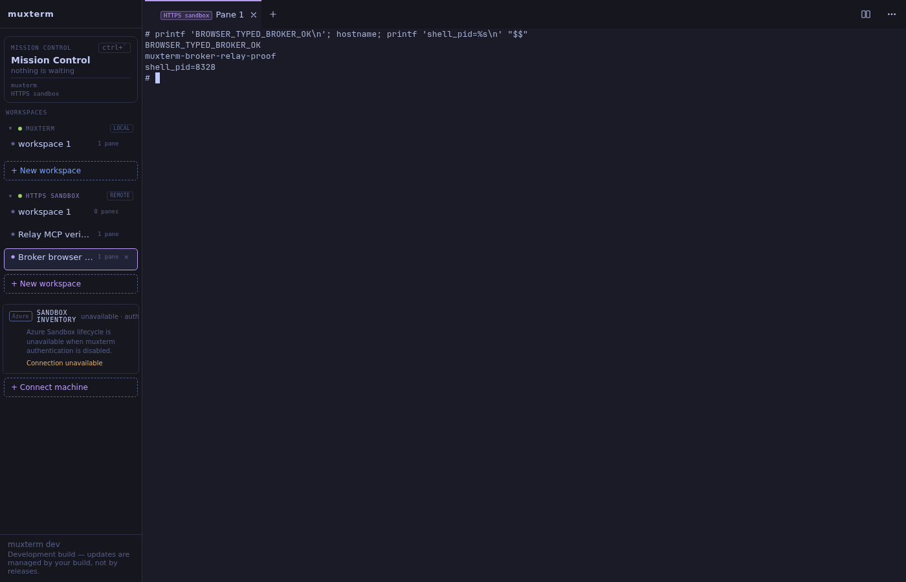
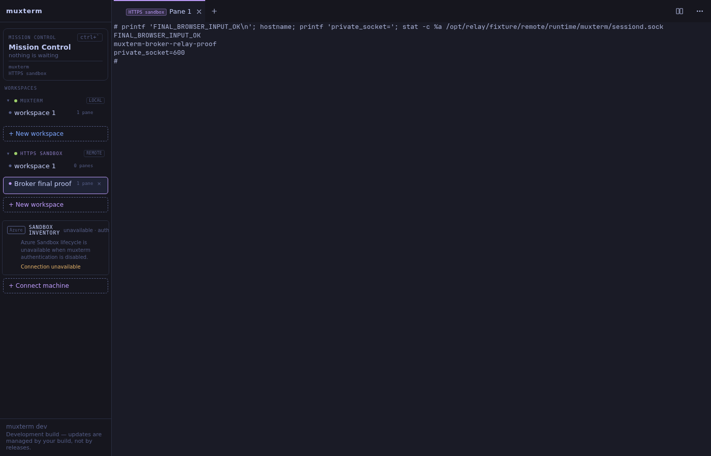

DID A HUMAN-VISIBLE SANDBOX WORKSPACE ACCEPT TYPED INPUT AND RETURN OUTPUT - YES.

The browser proof passed through the updated sandbox broker on **127.0.0.1:8089**, using the explicitly authorized alternate-port path. **Requirement (d), connection to the original process at exactly 127.0.0.1:8088, remained incomplete.** That process loaded no relay routes and had no reload option. PID 1782462 was never restarted, killed, or injected into. A separate uvicorn process loaded the source changes on 8089.

```text
PID COMMAND
1782462 /home/ken/workspace/sandboxes/.venv/bin/python3 .venv/bin/uvicorn broker.app:default_app --host 127.0.0.1 --port 8088 --app-dir .
Original broker title: Amplifier Sandbox Broker
Original broker relay /open present: False
8088 /discover HTTP 404
INFO: Started server process [1786733]
INFO: Uvicorn running on http://127.0.0.1:8089 (Press CTRL+C to quit)
```

This was a **REAL running broker process with REAL HTTP routes, and its LIFECYCLE BACKEND IS A STUB**: `StubBackend`. The original and alternate-port processes both selected it. This was local integration, not Azure. No ACA deployment, Entra authorization, private-disk import, or broker session-exec result was established. The default app also constructed its existing `FakeVault` placeholder; the relay did not use it. Relay authorization used separately enrolled static client and worker capabilities.

```text
1782462 SANDBOX_BROKER_BACKEND= UNSET
1786733 SANDBOX_BROKER_BACKEND= UNSET
# broker/app.py default_app() default branch:
from broker.stub_backend import StubBackend
backend = StubBackend(storage_root=data_dir / "sandboxes")
```

The changes landed in the running broker's source tree, `/home/ken/workspace/sandboxes/broker`: `muxterm_relay.py`, factory registration in `app.py`, and `LOCAL_MUXTERM_RELAY.md`. The FastAPI implementation replaced the Go reference broker in the verification path. The muxterm code built on branch `feat/https-sandbox-relay`, PR 161; the container used its experimental relay executable, not normal production muxterm startup.

```text
[feat/local-muxterm-relay 33487e0] Add opt-in local muxterm relay routes to FastAPI broker
3 files changed, 378 insertions(+)
create mode 100644 broker/LOCAL_MUXTERM_RELAY.md
create mode 100644 broker/muxterm_relay.py
```

The real shell ran in the `relay-worker` network namespace inside the owned Incus container `muxterm-broker-relay-proof`. Its outbound agent dialed TLS nginx at 10.222.0.1:443; nginx forwarded through a container loopback bridge to the host FastAPI broker on 8089. The browser server also dialed that TLS front end. The worker received input in its own long-poll responses and connected to real sessiond on a mode-600 Unix socket. There was no TCP listener in the worker namespace.

```text
$ ip netns exec relay-worker ss -ltnp
State Recv-Q Send-Q Local Address:Port Peer Address:PortProcess
$ ip netns exec relay-worker iptables -S
-P INPUT DROP
-P FORWARD ACCEPT
-P OUTPUT DROP
-A INPUT -i lo -j ACCEPT
-A INPUT -m conntrack --ctstate RELATED,ESTABLISHED -j ACCEPT
-A OUTPUT -o lo -j ACCEPT
-A OUTPUT -d 10.222.0.1/32 -p tcp -m tcp --dport 443 -j ACCEPT
$ stat -c '%a %n' /opt/relay/fixture/remote/runtime/muxterm/sessiond.sock
600 /opt/relay/fixture/remote/runtime/muxterm/sessiond.sock
```

The setup scripts were a **verification fixture**. The namespace firewall was a **simulation** of restricted sandbox networking inside an isolated container, not evidence of hostile-workload isolation. Client and worker shared the container filesystem except the worker's private `/tmp`. The terminal, shell, sessiond, outbound agent and HTTP broker were real processes. The old synthetic workspace `sandbox:fixture/w7` and Go reference implementation broker were not used.

Browser proof: Chromium opened `http://127.0.0.1:8314`, expanded the remote host, created `Broker browser proof`, focused its terminal, and typed using `page.keyboard.type` followed by Enter. These were automated browser keyboard actions in a human-visible UI; no human personally typed during this run. The terminal input was not injected by an HTTP shortcut.

```text
# printf 'BROWSER_TYPED_BROKER_OK\n'; hostname; printf 'shell_pid=%s\n' "$$"
BROWSER_TYPED_BROKER_OK
muxterm-broker-relay-proof
shell_pid=8328
#
```

Screenshot: `/home/ken/artifacts/sandbox-relay-browser.png`.
After fault injection and a fresh sessiond/worker reset, a new browser workspace `Broker final proof` also accepted keyboard input:

```text
# printf 'FINAL_BROWSER_INPUT_OK\n'; hostname; printf 'private_socket='; stat -c %a /opt/relay/fixture/remote/runtime/muxterm/sessiond.sock
FINAL_BROWSER_INPUT_OK
muxterm-broker-relay-proof
private_socket=600
#
```

Final screenshot: `/home/ken/artifacts/sandbox-relay-browser-final.png`.
Browser snapshot: `/home/ken/artifacts/sandbox-relay-browser-final.txt`.

The existing `relay-enable-faults.py` ran unchanged inside the owned container. `relay-reset-fixture.py` was adapted to omit the host broker and binary replacement, then ran against only owned container PIDs. The fault verifier targeted the FastAPI broker instead of the Go reference broker. Its broker-restart scenario was omitted. The worker was killed only after the shell side effect and before acknowledgement, then restarted with a fresh epoch. A new MCP connection read the same file once; old input was not replayed. This established deduplication and fencing in these injected cases, not exactly-once shell execution across arbitrary crashes.

```text
Only DTU nginx now routes through fault injector.
PASS redeliver {'hits': 1, 'held': True, 'duplicates': 2}
PASS lost-response {'hits': 2, 'held': True, 'duplicates': 0}
PASS output SSE disconnect/reconnect with same live daemon connection
PASS worker crash after Unix write: fresh epoch, no repeated shell side effect
PASS role and binding authorization rejects invalid/cross-role/cross-host access
PASS out-of-order input rejected; closed connection cannot receive input
Broker restart scenario omitted: broker is host-owned, not a DTU reference process.
/tmp/WORKER_DEDUP-1789944983902076714
WORKER_DEDUP
/tmp/BROKER_DEDUP-1789944983902076714
BROKER_DEDUP
/tmp/relay-uncertain-1789944983902076714
UNCERTAIN_INPUT
PASS worker rejected deliberately reordered input (seq+1); shell side-effect file absent: /tmp/WORKER_ORDER_MUST_NOT_EXECUTE
Fault counters: {"mode": "worker-order", "hits": 1, "held": true, "duplicates": 0, "sse_cuts": 0}
Only owned DTU fixture reset; initial browser evidence retained.
```

Full fault output: `sandbox-relay-fault-output.txt`, `sandbox-relay-worker-order-output.txt`, and `sandbox-relay-runtime-evidence.txt` under `/home/ken/artifacts/`. Reproduction scripts were added under muxterm `tools/https-relay/broker-integration/`.

Static verification completed without unit tests:

```text
go build ./...: exit 0
npm run check:fast: exit 0 (existing lint warnings)
ruff check broker/muxterm_relay.py: All checks passed!
python -m py_compile broker/muxterm_relay.py: exit 0
```

Known limits: the exact 8088 route remained absent; normal muxterm startup was not enabled; enrollment was manual and single-owner; relay state was volatile and single-process; the container's Mission Control sidecar lacked Amplifier and failed independently of the terminal. The browser displayed its existing unavailable Azure inventory panel, which was not the connected remote host.

```text
cos/sidecar: ModuleNotFoundError: No module named 'amplifier_app_cli'
```

The final workspace was left available on host port 8314. The owned container and alternate broker remained running. Its final process manifest was:

```text
Host broker: PID 1786733, 127.0.0.1:8089
Container: muxterm-broker-relay-proof
Current owned container PIDs: {"local": 8923, "remote": 8924, "worker": 8941, "serve": 8957, "fault-proxy": 8730}
```

Production muxterm ports 9090/8311, the orphan on 8313, production configuration, the original broker, Amplifier source, and Azure resources were not modified. No merge or release was performed.

Muxterm PR: https://github.com/kenotron-ms/muxterm/pull/161
Broker PR: https://github.com/kenotron-ms/amplifier-sandboxes/pull/14




