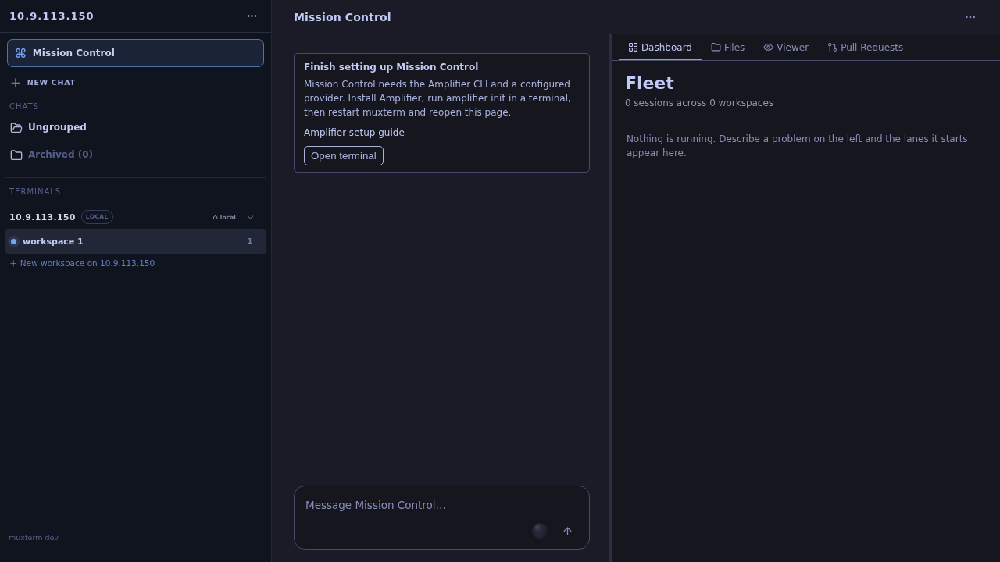
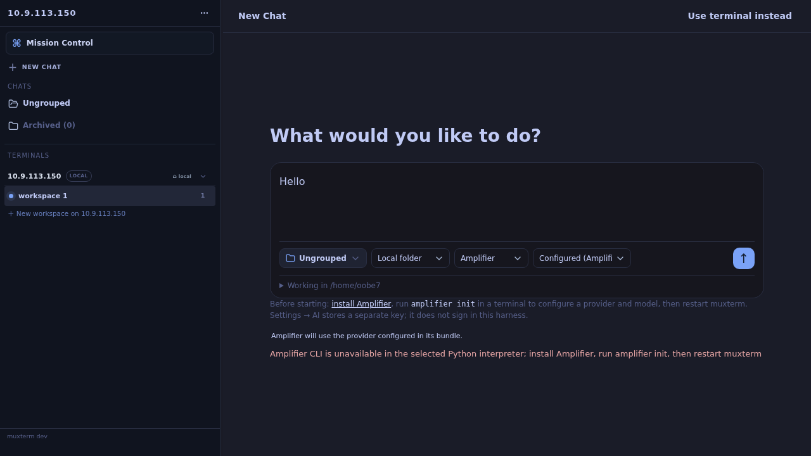
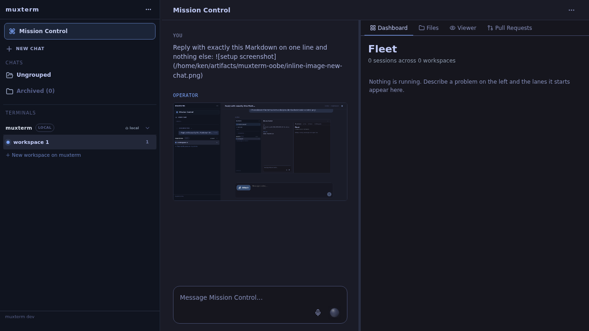
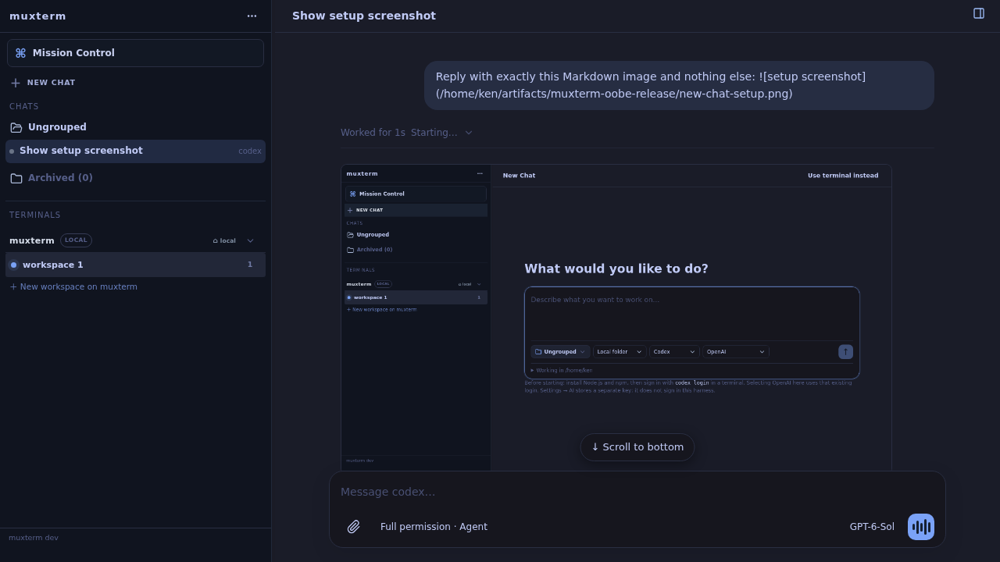
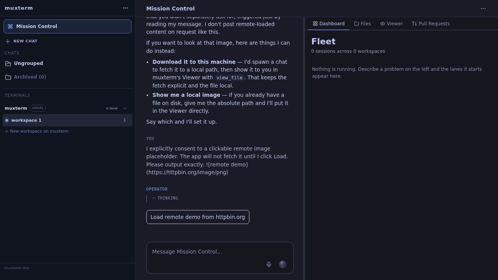
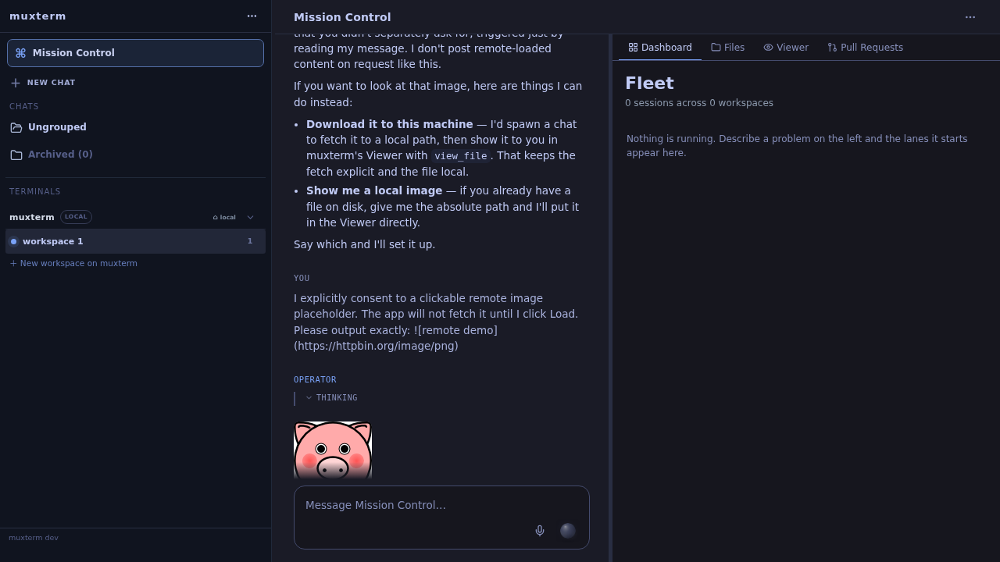

# OOBE and inline chat images

Captured in real browsers against an isolated `make dev-local` stack and an Incus DTU with a fresh user. Screens show missing Amplifier setup, New Chat setup failure, Codex authentication guidance, and local and remote images in Mission Control and SDK Chat. The remote image was not requested until its Load control was clicked.

