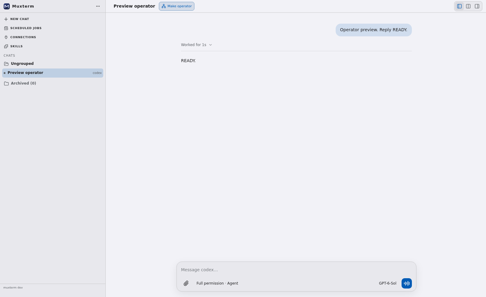
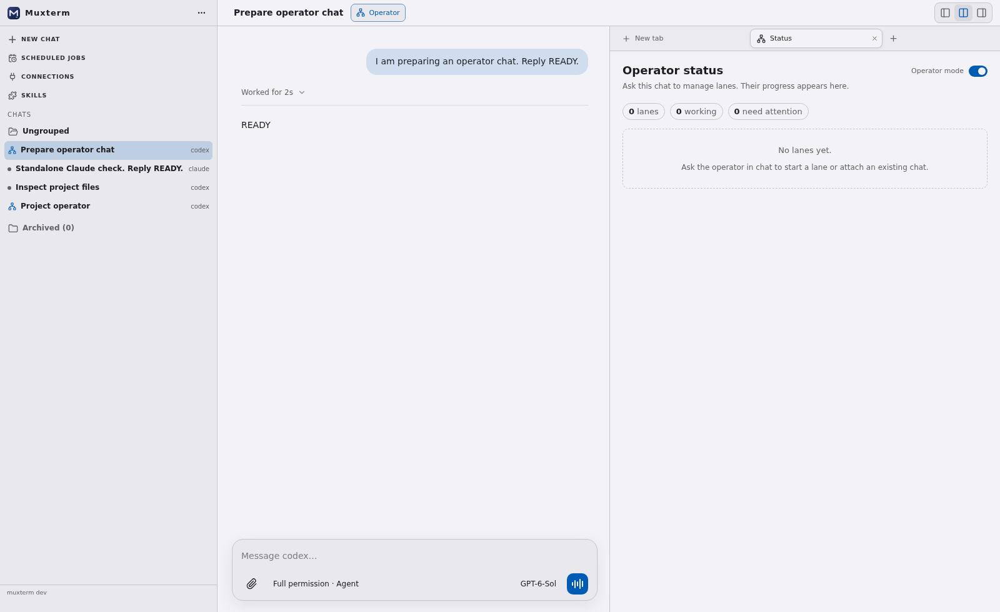
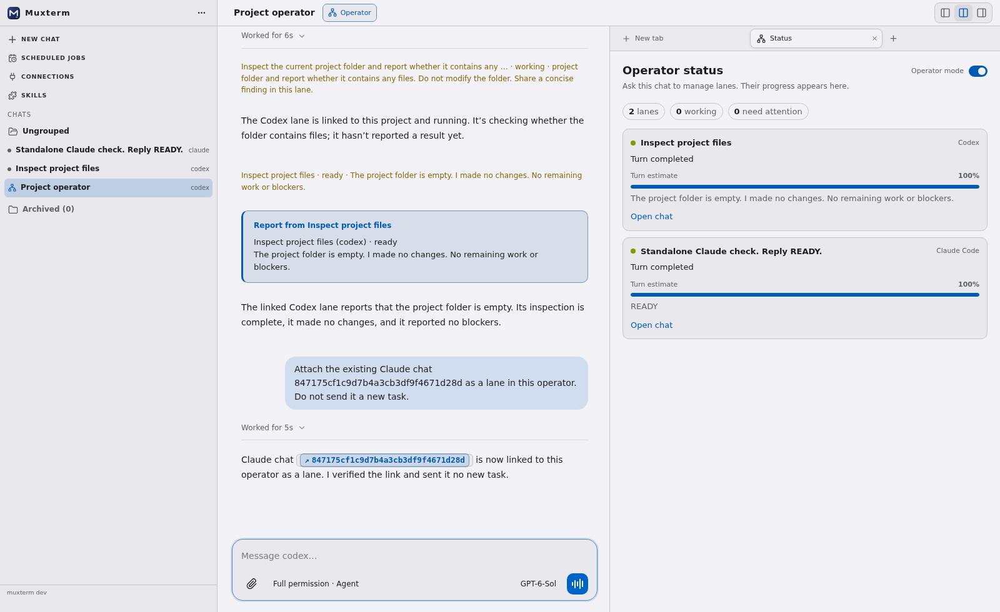

# Operator chat browser views

Captured against an isolated `make dev-local` instance with real Codex and
Claude SDK chats. Any chat can become an operator from its top bar. The Status
tab then opens with no lanes and directs the user to ask the chat to start or
attach one. In the active view, Codex and Claude lanes report completion to the
operator conversation and Status tab. These lanes used labeled turn estimates
because their plan tools were unavailable in the verification environment.

