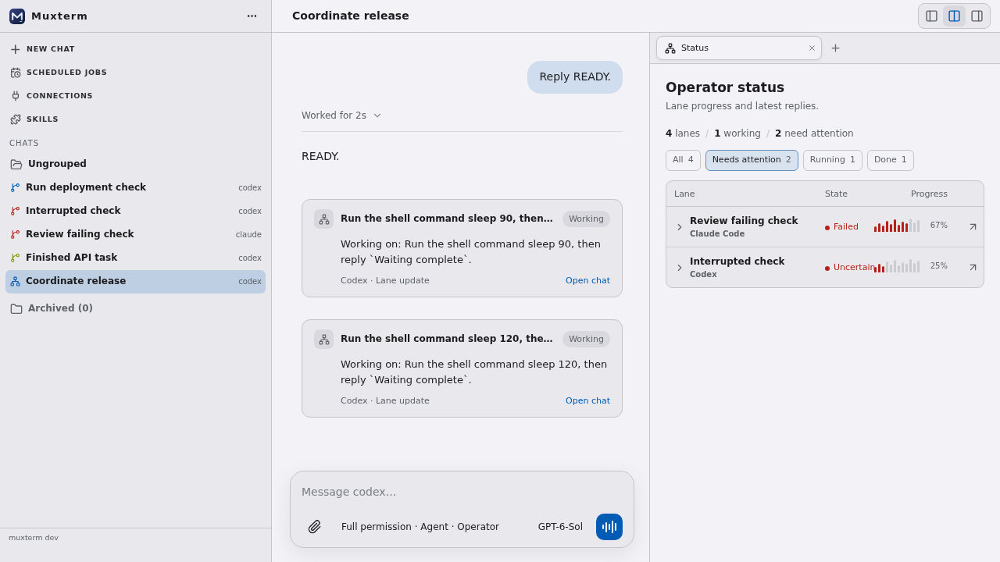
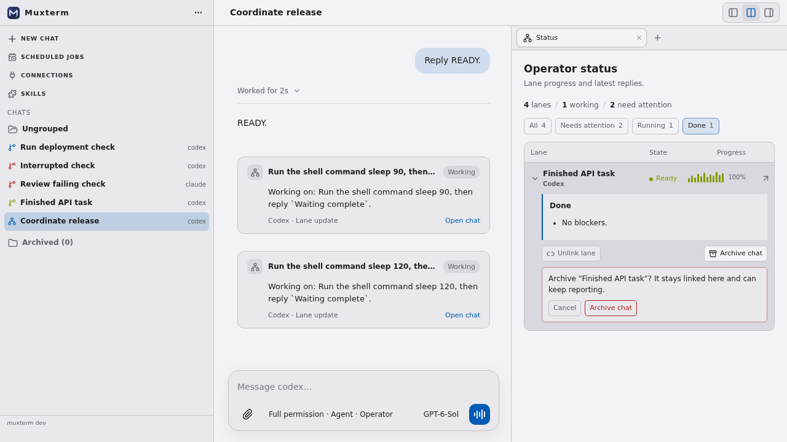
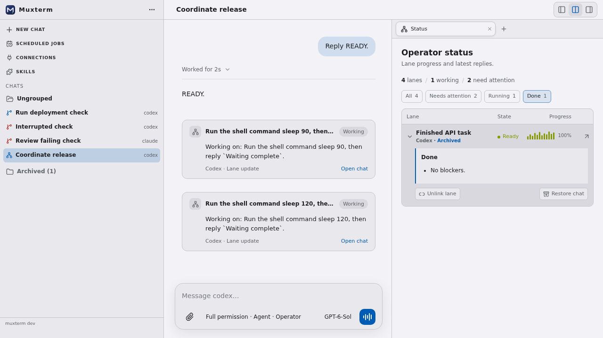

# Operator Status filters and actions

Verified in a real browser against isolated dev-local. The table filters linked lanes by attention, running, and done states. Expanded rows offer separate unlink and archive actions; archiving requires confirmation.

An archived lane remains linked and visible with an Archived marker and a Restore chat action. Unlinking removes it from this operator's Status while preserving the chat.

