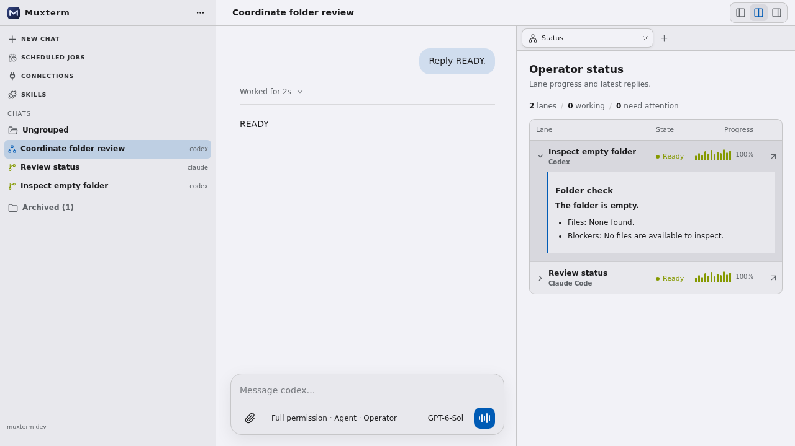
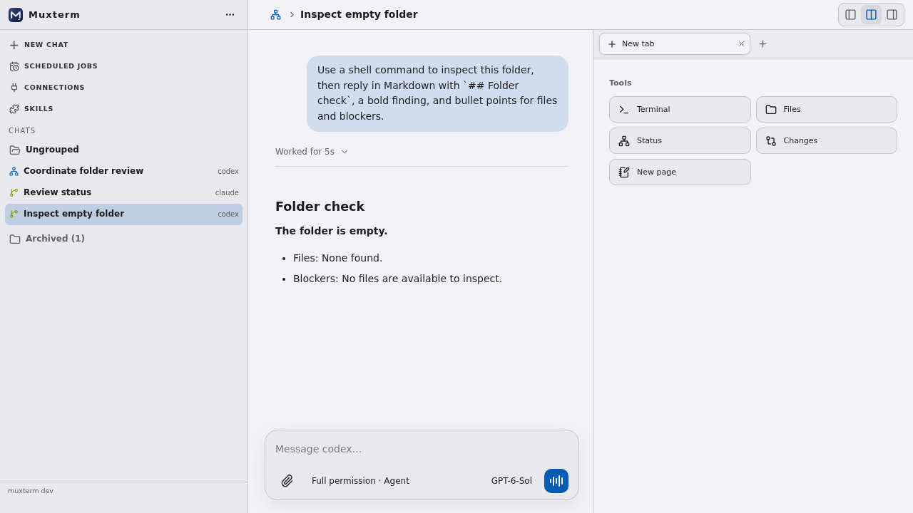

# Operator status table

Verified in an isolated `make dev-local` instance with a Codex operator and two existing chats adopted as lanes (Codex and Claude Code).

The Status tab shows a compact table with progress bars and the latest lane reply rendered as Markdown when expanded. The child chat header links back to its operator, and linked lanes use a status-colored sidebar icon.

Archived chats stay linked to their operator and remain in Status with an Archived marker. They keep their progress category, can still report, and can be restored from Status. Unlinking removes a lane from that operator's Status without archiving or stopping its chat.

