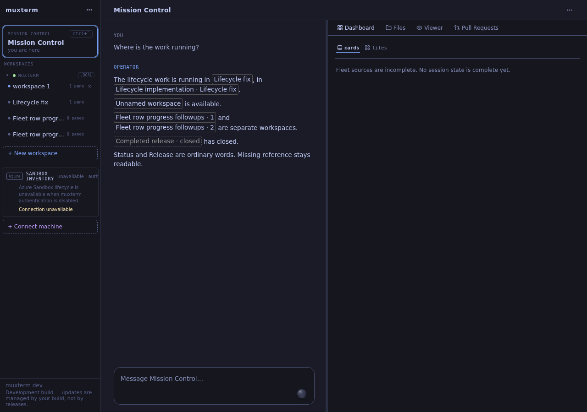
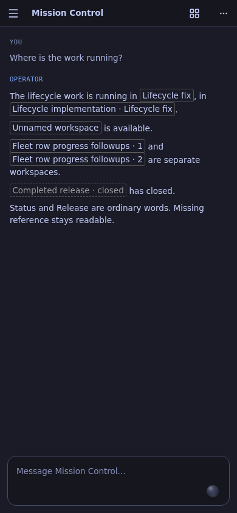
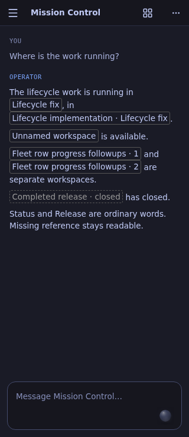
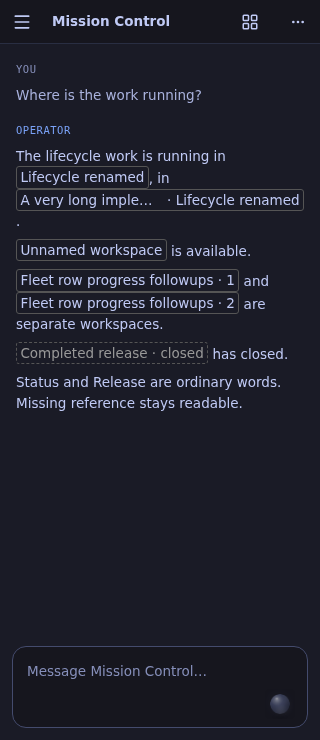

# Operator workspace and pane references

Verified on 2026-09-19 against `make dev-local`, port **8313**, with its own
sessiond, runtime/data directories and real shell panes. Production ports 9090
and 8311 and their processes were not changed. No unit tests were added or run.

## Reference contract

Tools supply ready-to-copy `workspace_ref` / `pane_ref` Markdown links:

```
[Lifecycle fix](muxterm:workspace/<workspace-uuid>?machine=local&status=live)
[Implementation · Lifecycle fix](muxterm:pane/<workspace-uuid>/1?machine=local&status=live)
```

Only these explicit link destinations are interpreted, only in Operator chat.
Names in ordinary prose and code are untouched. No HTML from the model is used;
Lit escapes the name. Invalid references fall back to their readable link label.
Unavailable inventory renders the label with `(unavailable)` as plain text.
References are labels, not navigation controls.

The persistent workspace UUID, machine and workspace-local pane id identify the
target. A reused `wN` from another daemon lifetime cannot hijack an old badge.
The existing daemon workspace snapshot now includes the small pane identity/name
inventory, and structural changes and renames publish a fresh snapshot. Reading
names requires neither attaching to a workspace nor replaying a terminal.

| Case | Behavior |
| --- | --- |
| Live named target | Current sidebar/tab name, flat inline outlined badge |
| Empty or whitespace name | `Unnamed workspace` / `Unnamed pane`; never a blank badge |
| Duplicate name | `Name · 1`, `Name · 2`, in current daemon/sidebar order within the machine; pane duplicates use pane order, plus workspace name/ordinal |
| Rename | Resolves live, so an earlier message still matches today's sidebar/tab |
| Closed target | Original readable reference label plus `· closed`, muted text and dashed outline |
| No historical name available | Honest `Unavailable workspace` / `Unavailable pane`, with closed/unavailable state; never invent a former name from a session's task title |
| Long label | Ellipsis within the message width, keeping space for the qualifier; full accessible name and native title |

Tool reference labels retain mention-time context (including duplicate ordinal
when present and pane workspace name) for the closed fallback. Live duplicate
ordinals can change when another duplicate closes; they describe the current
list order. Remote references are machine-qualified. Older daemons without the
new pane inventory retain the prior `list_panes` attach fallback and report
unavailable reference metadata rather than asserting that missing metadata means
a pane is closed.

## MCP audit

The common sessiond tool boundary enriches all successful JSON rows recursively.
Every `workspace_id` receives `workspace_name`, `workspace_ref`,
`workspace_status`; every `pane_id` also receives `pane_name`, `pane_ref`,
`pane_status` and workspace context. Bounded name-lookup failures do not turn a
successful mutation into a failed tool call that could be retried. Actions on
existing targets take a pre-call snapshot to retain names through closure.

| Tool | Before | Result |
| --- | --- | --- |
| `list_workspaces` | `id`, possibly empty `name` | Preserved; added workspace id, normalized display name and reference |
| `list_panes` | pane id, possibly empty `name` | Workspace context and named refs; current daemon inventory avoids changing attachment |
| `fleet_status` | ids plus session/task name, not workspace/pane names | Names/refs on every session row; gone targets explicitly marked |
| `spawn_lane` | ids only | Both names/refs, from the actual spawned pane/workspace |
| `create_pane` | pane id; optional `reference_pane` | Pane/workspace names/refs and `reference_pane_name` |
| `create_workspace` | workspace id only | Workspace name/ref |
| `switch_workspace` | `ok`, machine | Selected workspace id/name/ref |
| `session_send` | both ids only | Both names/refs |
| `send_input` | pane id only | Pane/workspace names/refs |
| `get_layout` | Raw ASCII containing numeric handles | JSON `{layout, workspace_id, ...names/refs, panes}`; named pane rows accompany the original diagram |
| `close_workspace` | `ok`, machine | Closed workspace id/name/ref, preserving the pre-close name |
| Trigger tools (`list/create/set_enabled/delete`) | Nested recent-fire ids | Same enrichment on every recent-fire row |
| `rename_pane`, `close_pane`, `run_command`, `get_screen`, `lane_transcript` | No workspace/pane ids in result | No id-bearing result omitted; id-free replies need no post-call lookup |
| File, machine, tunnel, config, publication, artifact tools | No workspace/pane ids in result | No structural handles to enrich |

`get_layout` intentionally changes from raw text to a JSON envelope. Its `layout`
field retains the original diagram. Tool description updated accordingly.
The chief-of-staff source charter tells the Operator to copy the badge form and
keep raw handles in tool arguments only. Existing unstructured transcript prose
is not retroactively guessed into references.

## Browser evidence

A fresh Chrome session runs the built application served by the real dev server.
The browser verification supplies an Operator transcript through its normal
WebSocket history frame, using references captured from real MCP responses. All
workspace/pane inventory, renames and closures come from the real daemon; none
are mocked. This proves message rendering and live resolution, not model
compliance with the new charter.

| Check | Result |
| --- | --- |
| Named, truly empty-name, duplicate and closed workspace badges at 1280×900 | PASS |
| Same four cases at 390×844 | PASS |
| Same cases at 320×740; all badge bounds inside viewport | PASS |
| Pane name and workspace context | PASS |
| Workspace rename updates already-rendered message | PASS |
| Long pane rename updates already-rendered message without overflow | PASS |
| Closing that real pane changes its existing badge to closed | PASS |
| Ordinary `Status`/`Release` prose and malformed destination remain plain text | PASS |






Raw real-daemon tool responses: [mcp-responses.json](mcp-responses.json).
Browser bounds and rename/close results: [browser-results.json](browser-results.json).

Reproduce with a clean isolated dev-local runtime (stop only its explicit PIDs):

```sh
make dev-local
# In another terminal, from this checkout:
make operator-reference-fixture
npx @playwright/cli -s=operator-badges open http://127.0.0.1:8313
npx @playwright/cli -s=operator-badges run-code --filename=tmp/reference-browser.cjs
npx @playwright/cli -s=operator-badges close
```

The fixture creates workspaces, real shell panes, publishes a session report from
inside a pane, checks `session_send`, launches and immediately closes a dedicated
Claude lane to verify `spawn_lane` output, and records responses. The browser
then renames and closes only those fixtures. Never run it against production.

Required static checks: `go build ./...`, `go vet ./...`, and
`cd web && npm run check:fast` (zero errors; existing unrelated lint warnings).
